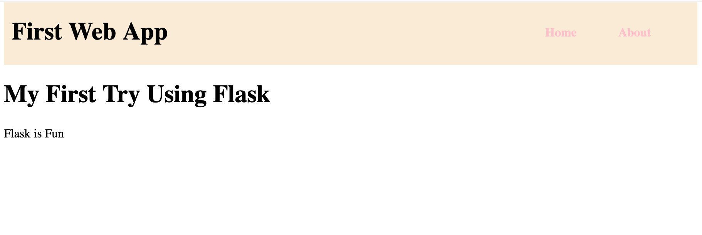
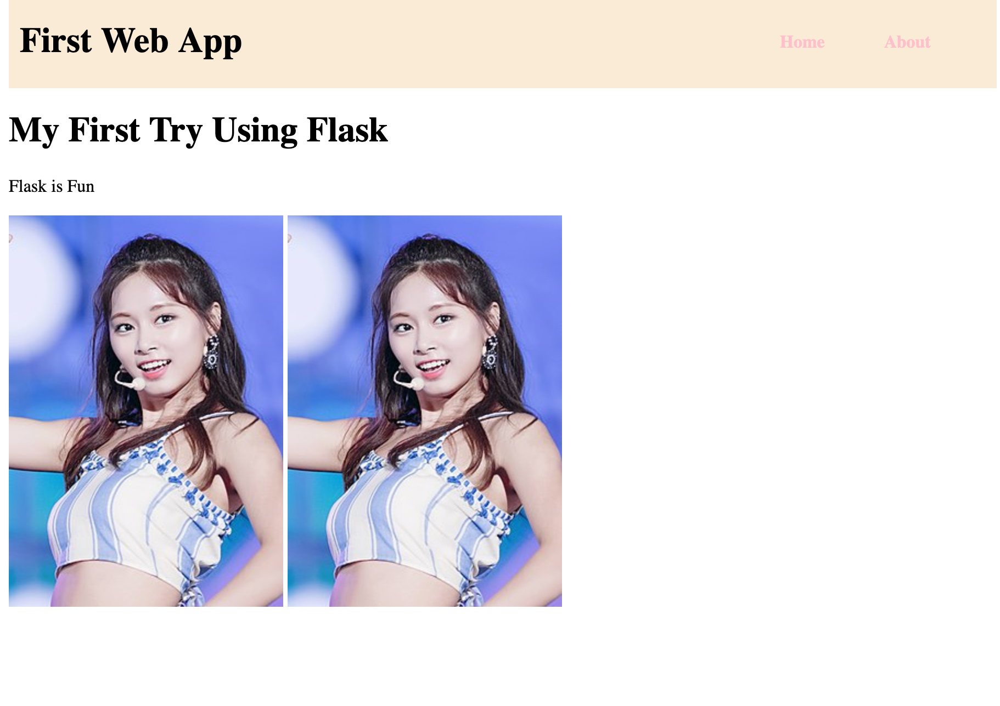
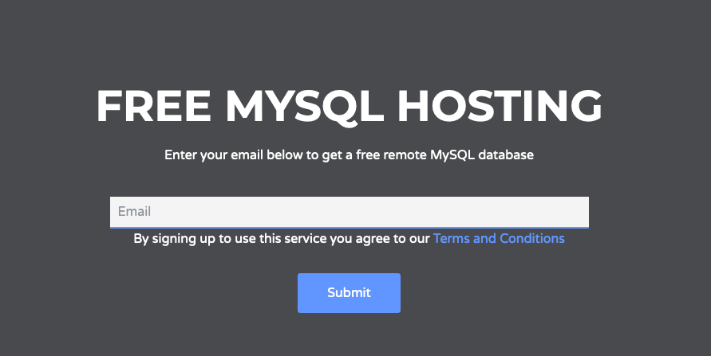
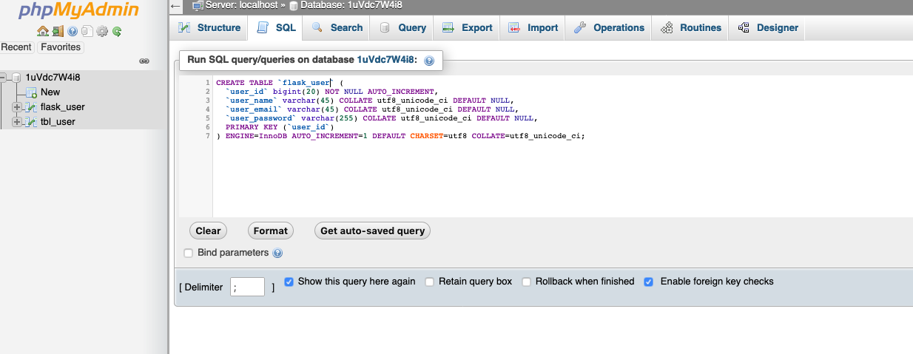
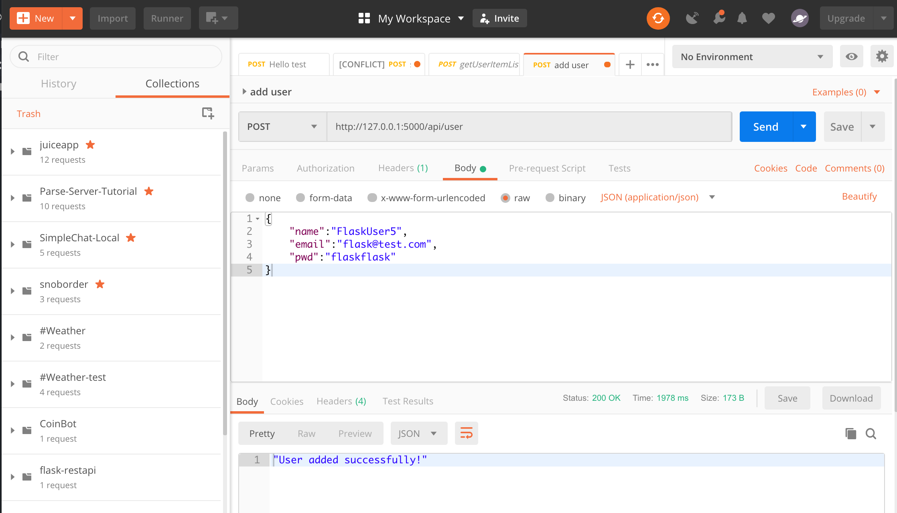
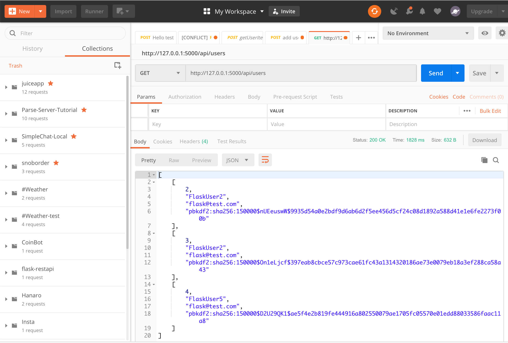
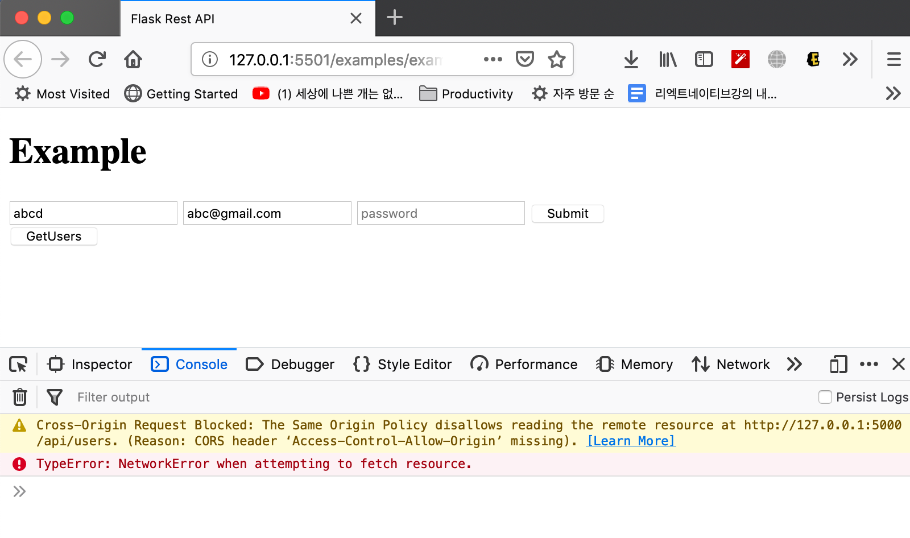

# Flask를 사용한 REST API 만들기

## HTTP, FLASK

HTTP는 웹사이트를 위한 프로토콜 일종의 규약입니다. 인터넷이 이 프로토콜을 사용하여 컴퓨터, 서버간의 통신을 하고 있습니다.

가령 여러분들이 브라우져상에 사이트주소를 적고 엔터를 치는 순간 HTTP 요청이 서버쪽으로 발생하게 되는 것입니다.

구글을 예로 들면 google.com를 주소창에 치고 엔터를 치는 순간 HTTP 요청은 구글 서버로 보내지게 됩니다. 구글 서버는 이 요청을 받은 후 어떠한 요청인지 해석한 후 다시 HTTP 응답으로 필요한 정보들을 담아 웹 브라우져로 응답해주게 됩니다. 그 후 여러분이 요청한 것에 대한 응답이 브라우져에 보여지게 되는 것입니다.


## Flask

플라스크를 사용하여 서버사이드 프로세싱이 가능한 웹 어플리케이션이나 Rest API 서버를 만들 수 있습니다. 앞으로 짤 코드를 통해 HTTP 요청을 받을 수 있으며 그것을 해석하여 특정한 작업을 수행하고 다시 알맞은 응답을 할 수 있을 것입니다.

Flask는 마이크로 프레임워크로서 간단한 웹 어플리케이션을 만드는데 특화되어 있습니다.

## 환경설정

Python 3.7 이상 설치: https://www.python.org/downloads/

Python package managerd니 pip를 최신 버전으로 업그레이드

```
> pip install --upgrade pip
```

VSCode의 경우 IDE 익스텐션을 설치하면 도움이 됩니다.
- Python


### Virtual Environment 설치

Virtualenv는 파이썬 환경을 저장하여 사용할 수 있게 해주는 툴입니다. 파이썬 프로젝트를 일종의 sandbox 환경에서 사용할 수 있게 해주는 툴이라고 생각할 수 있습니다. 파이썬 버전이 여러개인 경우 특히 유용합니다.

```
> pip3 install virtualenv
Collecting virtualenv
  Downloading https://files.pythonhosted.org/packages/4f/ba/6f9315180501d5ac3e707f19fcb1764c26cc6a9a31af05778f7c2383eadb/virtualenv-16.5.0-py2.py3-none-any.whl (2.0MB)
    100% |████████████████████████████████| 2.0MB 2.7MB/s
Installing collected packages: virtualenv
Successfully installed virtualenv-16.5.0
```

### Virtual Environment 구성

```
> which virtualenv
/usr/local/bin/virtualenv
```

프로젝트 폴더에 적용하기

특정 파이썬 버전을 가상 환경에서 사용하도록 적용합니다. 사용할 파이썬 버전을 적용해주세요.
-p 플래그는 가상환경에서 사용할 파이썬 버전의 경로를 입력하면 됩니다.

```
> which python3
/Library/Frameworks/Python.framework/Versions/3.7/bin/python3
```

방금 설치한 virtualenv 모듈을 사용하여 가상환경을 구성합니다.

```
> mkdir projects
> cd projects
> python3 -m venv env
Running virtualenv with interpreter /Library/Frameworks/Python.framework/Versions/3.7/bin/python3
Using base prefix '/Library/Frameworks/Python.framework/Versions/3.7'
New python executable in /Users/USERNAME/Documents/Projects/Tutorials/ParseServer-EB-Tutorial-MD/sandbox/examples/bin/python3
Also creating executable in /Users/USERNAME/Documents/Projects/Tutorials/ParseServer-EB-Tutorial-MD/sandbox/examples/bin/python
Installing setuptools, pip, wheel...
done.
```

이것을 통해 로컬 복사본을 가상 환경에 만들 수 있으며 패키지들의 의존성을 가상환경 내에서 관리할 수 있습니다.


### Virtual Environment 실행

아래 스크립트를 실행하여 가상 환경을 실행할 수 있으며

```
> source projects/env/bin/activate
```

해당 환경에 python이 설치되어 있는것을 볼 수 있습니다.

```
> which python
```
/Users/Documents/projects/env/bin/python


해당 환경에서는 `deactivate` 를 통해 빠져나올 수 있습니다.

```
> deactivate
```

앞으로는 방금 설치한 가상환경 상에서 프로젝트를 실행하도록 하겠습니다.


### Flask 설치

가상 환경상에 pip를 업그레이드 후 flask를 설치하도록 하겠습니다.
pip를 통해 pip를 최신버전으로 업그레이드합니다.
```
> pip install --upgrade pip
```

플라스클 설치 후
```
> pip install Flask
```

확인해보면 가상환경상에 설치된 것을 확인 가능합니다.

```
> which flask
/Users/Documents/projects/env/bin/flask
```

### 의존성 관리

협업 혹은 git 등을 이용하여 소스관리를 하거나 여러 컴퓨터에서 작업을 하는 경우, 의존성의 관리가 필요합니다.

pip freeze를 통해 의존성 확인 및 관리가 가능합니다.

```
> pip freeze

Click==7.0
Flask==1.0.2
itsdangerous==1.1.0
Jinja2==2.10.1
MarkupSafe==1.1.1
Werkzeug==0.15.2
```

가상환경상에서 현재 폴더에 의존성이 기록된 파일을 생성하는 방법입니다.

```
> env/bin/pip freeze > requirements.txt
```

차후 env2 환경에 같은 패키지 모듈들을 인스톨하고 싶은 경우
```
env2/bin/pip install -r requirements.txt
```

식으로 해당 패키지 모듈을 인스톨 가능합니다.

일반적으로 git을 통해 소스 관리를 하는 경우

.gitignore 파일에

`/projects/env` 를 통해 가상환경 설정폴더는 소스 관리에서 제외시키고, requirements.txt 를 통해 모듈의 인스톨, 삭제를 관리합니다.

## Flask 어플리케이션 생성 (example1)

app.py

```py
from flask import Flask
app = Flask(__name__)

@app.route('/')
def index():
  return 'Server Works!'

@app.route('/greet')
def say_hello():
  return '잘 돌아가고 있어요'

if __name__ == "__main__":
    app.run(debug=True)
```

Flask 클래스를 임포트 한 후 appd이라는 인스턴스를 만들었습니다.

파이썬 인터프리터 명령어로 스크립트가 실행되는 경우, 파이썬은 자동으로 실행되는 메인함수가 없습니다. `__name__`은 현재 모듈의 이름을 담고 있는 내장 변수이고, flask app.py 처럼 이 모듈을 직접 실행하는 경우 `__main__`으로 설정됩니다.

@는 데코레이션 방식으로 함수를 사용할수 있게 해주는 방식으로서 route를 간단히 적용할 수 있게 도와줍니다.

`if __name__ == "__main__":` 는 Python을 통해 실행할 경우 app.run이 실행되고 다른곳에서 해당 파일을 import할 경우에는 `app.run`이 실행되지 않을 것입니다.

`debug=true`는 파이썬의 에러를 웹페이지에도 표시할 수 있게 해주는 옵션으로서 개발환경에서만 사용하길 권합니다.

바로 구동하고 테스트해보도록 하겠습니다.

```
> python app.py

* Serving Flask app "app" (lazy loading)
 * Environment: production
   WARNING: Do not use the development server in a production environment.
   Use a production WSGI server instead.
 * Debug mode: on
 * Running on http://127.0.0.1:5000/ (Press CTRL+C to quit)
 * Restarting with stat
 * Debugger is active!
 * Debugger PIN: 101-546-803
127.0.0.1 - - [02/May/2019 16:32:15] "GET / HTTP/1.1" 200 -
127.0.0.1 - - [02/May/2019 16:32:16] "GET /favicon.ico HTTP/1.1" 404
```

`http://127.0.0.1:5000/`를 통해 브라우져에서 테스트가 가능합니다.

`http://127.0.0.1:5000/greet` 로도 접속해보시고 `return` 에 있는 응답을 다른 텍스트로 변경해보세요.

## HTML, CSS 와 Flask

### HTML, Templates

일단 `home.html`이라는 HTML 파일을 만들어 보도록 하겠습니다.

templates/home.html

```html
<!DOCTYPE html>
<html lang="en" dir="ltr">
  <head>
    <meta charset="utf-8">
    <title>Flask Tutorial</title>
  </head>
  <body>
    <h1> My First Try Using Flask </h1>
    <p> Flask is Fun </p>
  </body>
</html>
```

`app.py` 파일에서 해당 html 파일을 불러와 보여주도록 수정합니다.
render_tempalte import를 잊지 마세요.

app.py

```py
from flask import Flask, render_template
app = Flask(__name__)

@app.route('/')
def home():
  return render_template("home.html")

@app.route('/greet')
def say_hello():
  return '잘 돌아가고 있어요!!'

if __name__ == "__main__":
  app.run(debug=True)
```

flask 프레임워크로부터 render_template 메쏘드를 import 하였습니다. 이것은 templates 폴더 안에 있는 템플릿(HTML) 파일들을 찾은 후 render하여 보여줍니다.

이제 다시 `http://127.0.0.1:5000/`에 접속하면 해당 HTML 파일이 출력되는 것을 볼 수 있습니다.

### 템플릿 추가하기

about.html 파일을 추가하도록 하겠습니다.

templates/about.html

```html
<!DOCTYPE html>
<html lang="en" dir="ltr">
  <head>
    <meta charset="utf-8">
    <title>About Flask</title>
  </head>
  <body>
    <h1> About Flask </h1>
    <p> Flask is a micro web framework written in Python.</p>
    <p> Applications that use the Flask framework include Pinterest,
      LinkedIn, and the community web page for Flask itself.</p>
  </body>
</html>
```

app.py

```py
from flask import Flask, render_template
app = Flask(__name__)

@app.route('/')
def home():
  return render_template("home.html")

@app.route('/about')
def about():
  return render_template("about.html")

if __name__ == "__main__":
  app.run(debug=True)
```

다른 설명이 필요 없을 정도로 동일한 과정입니다.
이제 두 페이지를 연결해보겠습니다.

### 두 페이지 연결하기

두 페이지 연결을 위해 네비게이션 메뉴를 상단 부분에 만들도록 하겠습니다.

templates/home.html

```html
<!DOCTYPE html>
<html lang="en" dir="ltr">

<head>
  <meta charset="utf-8">
  <title>Flask Tutorial</title>
</head>

<body>
  <header>
    <div class="container">
      <h1 class="logo">First Web App</h1>
      <strong>
        <nav>
          <ul class="menu">
            <li><a href="{{ url_for('home') }}">Home</a></li>
            <li><a href="{{ url_for('about') }}">About</a></li>
          </ul>
        </nav>
      </strong>
    </div>
  </header>

  <h1> My First Try Using Flask </h1>
  <p> Flask is Fun </p>
</body>

</html>
```

templates/about.html

```html
<!DOCTYPE html>
<html lang="en" dir="ltr">

<head>
  <meta charset="utf-8">
  <title>About Flask</title>
</head>

<body>
  <header>
    <div class="container">
      <h1 class="logo">First Web App</h1>
      <strong>
        <nav>
          <ul class="menu">
            <li><a href="{{ url_for('home') }}">Home</a></li>
            <li><a href="{{ url_for('about') }}">About</a></li>
          </ul>
        </nav>
      </strong>
    </div>
  </header>

  <h1> About Flask </h1>
  <p> Flask is a micro web framework written in Python.</p>
  <p> Applications that use the Flask framework include Pinterest,
    LinkedIn, and the community web page for Flask itself.</p>
</body>

</html>
```

기존 페이지에 각각 header를 추가하고 링크를 통해 페이지를 이동할 수 있도록 하였습니다.

코드를 보시면 `url_for()`를 사용한 것을 볼 수 있습니다.이것은 인자값을 받아 여러 역할이 가능한데, 여기서는 static 파일을 읽어오는 것과, app.py에서 route에 정의된 메쏘드로 연결하는 역할을 하고 있습니다.

즉 url_for('home')일 경우는 def home()에 정의된 라우터로 연결되게 됩니다.

이것은 기존의 전통적인 html 페이지를 만드는 방식과 유사한데 페이지가 많아질 경우 <header> 의 영역을 모든 페이지에 붙여넣고 사용해야하는 번거로움과 유지 보수의 문제가 생길 것입니다. 그러므로 template 엔진의 장접을 이용해 html 파일들을 모듈화하여 사용해 보겠습니다.

### Template 장점 살리기

바로 직전에 했던것처럼 반복되는 코드의 사용을 방지하기 위해 template.html 이라는 파일을 만들고 이 파일에서 내용만 새로 불러와 변경하는 식으로 연결을 할 것입니다.

templates/template.html

```html
<!-- Start template.html -->
<!DOCTYPE html>
<html lang="en" dir="ltr">

<head>
  <meta charset="utf-8">
  <title>Template</title>
  <link rel="stylesheet" href="{{ url_for('static', filename='css/template.css') }}">
</head>

<body>
  <header>
    <div class="container">
      <h1 class="logo">First Web App</h1>
      <strong>
        <nav>
          <a href="{{ url_for('home') }}">Home</a>
          <a href="{{ url_for('about') }}">About</a>
        </nav>
      </strong>
    </div>
  </header>



</body>
</html>
<!-- End template.html-->
```

여기에서

```


```

이 부분은 home.html 혹은 about.html의 컨텐츠가  대체될 부분입니다. 즉 컨텐츠 블록을 지정하고 그 부분에 다른 템플릿으로부터 컨텐츠를 넣을 수 있도록 해줍니다.
그러므로 자식 페이지들(home.html, about.html)이 부모 페이지인 template.html에서 호출되어 내용이 변경될 수 있도록 할 것입니다. 그러므로 기존의 html 방식에서는 동일한 코드라도 모든 페이지에 입력하여야만 사용할 수 있는 방법을 HTML 파일을 모듈화 시켜 불러서 사용할 수 있도록 바꿔주는 것입니다.

이제 home.html, about.html 의 코드를 수정하고 tempalte.html과 연동되어 동작하도록 해보겠습니다.

templates/about.html

```html


<title>Template</title>

  <h1> About Flask </h1>
  <p> Flask is a micro web framework written in Python.</p>
  <p> Applications that use the Flask framework include Pinterest,
    LinkedIn, and the community web page for Flask itself.</p>


```

templates/home.html

```html



<title>Flask Tutorial</title>

<h1> My First Try Using Flask </h1>
<p> Flask is Fun </p>


```

`python app.py`를 통해 실행후 확인해보세요.

view page source 옵션을 통해 페이지 내용이 어떻게 보이는지 확인하세요.

이것은 home.html과 about.html에서 `extends "template.html"`을 통해 tempalte 페이지를 가져와 확장하는 방식으로 페이지를 구성하였습니다.

### CSS 파일로 꾸미기

templates 폴더를 만든 것처럼 static 폴더를 만들 것입니다. 이 곳에는 css, JavaScript, images 등의 파일들을 넣어 사용할 수 있습니다.

이번 챕터에서는 template.html에 있던 이 코드를 통해 css를 적용해 볼 것입니다.

```html
<link rel="stylesheet" href="{{ url_for('static', filename='css/template.css') }}">
```

static/css/template.css

```css
body {
  margin: auto;
  max-width: 900px;
}

header {
  background-color: antiquewhite;
  padding: 0 10px;
}

header .container {
  display: flex;
  flex-direction: row;
  align-items: center;
  justify-content: space-between;
}

header nav>* {
  text-decoration: none;
  color: pink;
  margin-right: 50px;
}
```

바로 적용이 되는 것을 볼 수 있습니다.



### 이미지 등 파일 로드하기

 css를 사용했던 것과 마찬가지로 이미지 또한 사용이 가능합니다. 실행하는 app.py 기준으로 절대주소를 사용할 수도 있으며 url_for또한 사용할 수 있습니다.

templates/home.html

```html



<title>Flask Tutorial</title>

<h1> My First Try Using Flask </h1>
<p> Flask is Fun </p>



```



## FLASK로 REST API 작성하기 (example2)

최근 들어서는 앱서버에서 템플릿을 통해 서비스를 운영하는 방식에서 백엔드와 프론트엔드를 분리하여 API를 호출하여 응답을 처리하는 SPA(Single Page Application) 방식을 많이 사용하고 있습니다. 특히 모바일 애플리케이션 서비스의 경우 서버사이드와 완전히 분리가 되어 있기 때문에 위에서 해온 방식으로는  서비스를 만들 수가 없습니다.

그러므로 여기서는 간단하게 REST API 방식으로 Flask 서버를 사용해 보겠습니다.

일단 새로운 프로젝트를 진행할 폴더를 만들어주세요.

### REST? RESTful?

REST에서 제일 중요한 컨셉은 일반적으로 URI를 사용해서 리소스에 대한 정보를 요청하는 방식입니다. 클라이언트 애플리케이션에서 GET, POST, PUT, DELETE 등의 HTTP 메쏘드를 사용하여 리소스에 대한 요청을 보내고, RESTful 웹 서비스에서는 그에 상응하는 리소스 응답을 주게 됩니다.

HTTP 메소드는 리소스의 CRUD와 매치되게 되며 각 방식은 다음과 같습니다.

- GET: Read
- POST: Create
- PUT: Update
- DELETE: Delete

### 데이터베이스 생성하기

간단한 무료 호스팅을 이용하여 MySQL 데이터베이스를 사용해보도록 하겠습니다.

https://remotemysql.com/

에서 바로 발급되는 데이터베이스 서버를 저장하세요.



그 후  https://remotemysql.com/phpmyadmin/ 를 통해 해당 서버에 접속할 수 있습니다.

이제 쿼리를 통해 유저 데이터베이스를 생성해보도록 하곘습니다.

```sql
CREATE TABLE `flask_user` (
  `user_id` bigint(20) NOT NULL AUTO_INCREMENT,
  `user_name` varchar(45) COLLATE utf8_unicode_ci DEFAULT NULL,
  `user_email` varchar(45) COLLATE utf8_unicode_ci DEFAULT NULL,
  `user_password` varchar(255) COLLATE utf8_unicode_ci DEFAULT NULL,
  PRIMARY KEY (`user_id`)
) ENGINE=InnoDB AUTO_INCREMENT=1 DEFAULT CHARSET=utf8 COLLATE=utf8_unicode_ci;
```



앞으로 사용할 데이터베이스가 완성되었습니다.

### app.py 생성

app.py

```
from flask import Flask

app = Flask(__name__)
```

기본적인 flask 인스턴스입니다.

### 데이터베이스 연결하기

```py
> pip install flask-mysql
```

db_config.py

```py
from flask import Flask
from flaskext.mysql import MySQL
from app import app

mysql = MySQL()

# MySQL configurations
app.config['MYSQL_DATABASE_USER'] = 'user'
app.config['MYSQL_DATABASE_PASSWORD'] = 'password'
app.config['MYSQL_DATABASE_DB'] = 'dbname'
app.config['MYSQL_DATABASE_HOST'] = 'hosturl'
app.config['MYSQL_DATABASE_PORT'] = 3306 # Default 3306

mysql.init_app(app)
```

위와 같이 앞에서 만든 데이터베이스 정보를 입력합니다.

### REST API 서버 실행하기

이제 새로운 파일을 만들고 클라이언트의 요청을 받아 데이터베이스에서 알맞은 동작을 수행 후 응답해주는 동작을 구현해보겠습니다.

restapi.py

```py
# import pymysql
from app import app
from db_config import mysql
from flask import jsonify
from flask import flash, request
from werkzeug import generate_password_hash, check_password_hash

@app.route('/api/user', methods=['POST'])
def add_user():
    conn = mysql.connect()
    cursor = conn.cursor()

    try:
        _json = request.json
        _name = _json['name']
        _email = _json['email']
        _password = _json['pwd']
        # validate the received values
        if _name and _email and _password and request.method == 'POST':
            #do not save password as a plain text
            _hashed_password = generate_password_hash(_password)
            # save edits
            sql = "INSERT INTO flask_user(user_name, user_email, user_password) VALUES(%s, %s, %s)"
            data = (_name, _email, _hashed_password,)
            cursor.execute(sql, data)
            conn.commit()
            resp = jsonify('User added successfully!')
            resp.status_code = 200
            return resp
        else:
            return not_found()
    except Exception as e:
        print(e)

@app.route('/api/users')
def users():
    conn = mysql.connect()
    cursor = conn.cursor()

    try:
        cursor.execute("SELECT * FROM flask_user")
        rows = cursor.fetchall()
        resp = jsonify(rows)
        resp.status_code = 200
        return resp
    except Exception as e:
        print(e)

@app.route('/api/user/<int:id>')
def user(id):
    conn = mysql.connect()
    cursor = conn.cursor()

    try:
        cursor.execute("SELECT * FROM flask_user WHERE user_id=%s", id)
        row = cursor.fetchone()
        resp = jsonify(row)
        resp.status_code = 200
        return resp
    except Exception as e:
        print(e)

@app.route('/api/update', methods=['POST'])
def update_user():
    conn = mysql.connect()
    cursor = conn.cursor()

    try:
        _json = request.json
        _id = _json['id']
        _name = _json['name']
        _email = _json['email']
        _password = _json['pwd']
        # validate the received values
        if _name and _email and _password and _id and request.method == 'POST':
            #do not save password as a plain text
            _hashed_password = generate_password_hash(_password)
            # save edits
            sql = "UPDATE flask_user SET user_name=%s, user_email=%s, user_password=%s WHERE user_id=%s"
            data = (_name, _email, _hashed_password, _id,)
            cursor.execute(sql, data)
            conn.commit()
            resp = jsonify('User updated successfully!')
            resp.status_code = 200
            return resp
        else:
            return not_found()
    except Exception as e:
        print(e)
    finally:
        cursor.close()
        conn.close()

@app.route('/api/delete/')
def delete_user(id):
    conn = mysql.connect()
    cursor = conn.cursor()

    try:
        cursor.execute("DELETE FROM flask_user WHERE user_id=%s", (id,))
        conn.commit()
        resp = jsonify('User deleted successfully!')
        resp.status_code = 200
        return resp
    except Exception as e:
        print(e)
    finally:
        cursor.close()
        conn.close()

@app.errorhandler(404)
def not_found(error=None):
    message = {
        'status': 404,
        'message': 'Not Found: ' + request.url,
    }
    resp = jsonify(message)
    resp.status_code = 404

    return resp

if __name__ == "__main__":
    app.run(debug=True)
```

메쏘드별로 코드를 살펴보고
Postman을 통해 테스트를 해보겠습니다.

유저 추가


유저 리스트 확인


개별 유저 확인 및 유저 삭제, 업데이트도 해보세요.

(삭제, 업데이트는 id 입력받는 곳이 없어 동작을 안할 것입니다.)

### REST API 식으로 바꾸기

앞에 REST API의 개념에 대해 설명한 것과 같이 코드를 수정하여 동작하도록 해보겠습니다.

```py
# import pymysql
from app import app
from db_config import mysql
from flask import jsonify
from flask import flash, request
from werkzeug import generate_password_hash, check_password_hash

def add_user():
    conn = mysql.connect()
    cursor = conn.cursor()

    try:
        _json = request.json
        _name = _json['name']
        _email = _json['email']
        _password = _json['pwd']
        # validate the received values
        if _name and _email and _password and request.method == 'POST':
            #do not save password as a plain text
            _hashed_password = generate_password_hash(_password)
            # save edits
            sql = "INSERT INTO flask_user(user_name, user_email, user_password) VALUES(%s, %s, %s)"
            data = (_name, _email, _hashed_password,)
            cursor.execute(sql, data)
            conn.commit()
            resp = jsonify('User added successfully!')
            resp.status_code = 200
            return resp
        else:
            return not_found()
    except Exception as e:
        print(e)

def update_user():
    conn = mysql.connect()
    cursor = conn.cursor()

    try:
        _json = request.json
        _id = _json['id']
        _name = _json['name']
        _email = _json['email']
        _password = _json['pwd']
        # validate the received values
        if _name and _email and _password and _id and request.method == 'POST':
            #do not save password as a plain text
            _hashed_password = generate_password_hash(_password)
            # save edits
            sql = "UPDATE flask_user SET user_name=%s, user_email=%s, user_password=%s WHERE user_id=%s"
            data = (_name, _email, _hashed_password, _id,)
            cursor.execute(sql, data)
            conn.commit()
            resp = jsonify('User updated successfully!')
            resp.status_code = 200
            return resp
        else:
            return not_found()
    except Exception as e:
        print(e)
    finally:
        cursor.close()
        conn.close()

def get_user(id):
    conn = mysql.connect()
    cursor = conn.cursor()

    try:
        cursor.execute("SELECT * FROM flask_user WHERE user_id=%s", id)
        row = cursor.fetchone()
        resp = jsonify(row)
        resp.status_code = 200
        return resp
    except Exception as e:
        print(e)

def delete_user(id):
    conn = mysql.connect()
    cursor = conn.cursor()

    try:
        cursor.execute("DELETE FROM flask_user WHERE user_id=%s", (id,))
        conn.commit()
        resp = jsonify('User deleted successfully!')
        resp.status_code = 200
        return resp
    except Exception as e:
        print(e)
    finally:
        cursor.close()
        conn.close()

@app.route('/api/user', methods=['POST'])
def adduser():
    if request.method == 'POST':
        return add_user()

@app.route('/api/users')
def users():
    conn = mysql.connect()
    cursor = conn.cursor()

    try:
        cursor.execute("SELECT * FROM flask_user")
        rows = cursor.fetchall()
        resp = jsonify(rows)
        resp.status_code = 200
        return resp
    except Exception as e:
        print(e)

@app.route('/api/user/<int:id>', methods=['GET', 'DELETE', 'PUT'])
def user(id):
    if request.method =='GET':
        return get_user(id)
    elif request.method == 'PUT':
        return update_user(id)
    elif request.method == 'DELETE':
        return delete_user(id)

@app.errorhandler(404)
def not_found(error=None):
    message = {
        'status': 404,
        'message': 'Not Found: ' + request.url,
    }
    resp = jsonify(message)
    resp.status_code = 404

    return resp


if __name__ == "__main__":
    app.run(debug=True)
```

한층 더 RESTful 해진 api입니다. `/api/user/<id>` 를 통해 유저를 조회, 수정, 삭제를 할 수 있으며 `/api/user`에 POST 요청을 통해 유저를 생성할 수도 있습니다.


## 웹페이지와 REST Api를 이용한 통신

이번 장에서는 앞에서 만든 REST Api를 이용해 프론트엔드에서 HTTP 요청을 통해 통신을 해보도록 하겠습니다.

### Same-Origin Policy

> 자바스크립트 엔진 표준 스펙의 보안 규칙 중 하나이다. 자바스크립트는 자신이 속한 동일한 출처의 페이지에만 서버 요청을 허용하고 처리해 주며, 다른 출처의 서버에 요청하는 것을 보안 문제로 간주하고 차단한다. 여기서 동일한 출처(same origin)란 같은 프로토콜, 같은 호스트, 같은 포트를 사용한다는 것이다.


### CORS(Cross-Origin Resource Sharing)

다른 도메인(domains)에서의 자원을 호출하는 행위에 제한이 없을 경우 안전하지 않습니다. CORS (Cross-Origin Resource Sharing)는 이렇게 시스템 수준에서 타 도메인 간 자원 호출을 승인하거나 차단하는 것을 결정하는 것입니다

다른 도메인간의 리소스를 주고받는것을 허용, 혹은 차단하는 설정

한마디로 보안 문제때문에 기본적으로는 다른 도메인으로부터의 HTTP 요청은 막혀있습니다.

### 웹페이지

일단 간단한 테스트용 웹페이지를 생성해 보도록 하겠습니다. 프론트엔드용 폴더를 하나 만들어주시고 그곳에 index.html 파일을 생성해주세요.

VSCode에서는 Live Server 익스텐션을 사용하시길 추천합니다.

index.html

```html
<!DOCTYPE html>
<html lang="en">

<head>
    <meta charset="UTF-8">
    <meta name="viewport" content="width=device-width, initial-scale=1.0">
    <meta http-equiv="X-UA-Compatible" content="ie=edge">
    <!-- <link rel="stylesheet" type="text/css" media="screen" href="index.css"> -->

    <title>Flask Rest API</title>
</head>

<body>
    <header>
        <h1>Example</h1>
        <div id="result"></div>
    </header>

    <div class="contents adduser">
        <input id="name" type="text" placeholder="Write name">
        <input id="email" type="text" placeholder="email">
        <input id="password" type="password" placeholder="password">
        <button onclick="addUserSelected()">Submit</button>
    </div>

    <div class="contents">
        <button onclick="getusers()">GetUsers</button>
        <div id='response'>

        </div>
    </div>
</body>

</html>

<script>
    async function getusers() {
        const res = await fetch('http://127.0.0.1:5000/api/users', {
            method: "GET", // POST, PUT, DELETE, etc.
        });

        const result = await res.json();
        console.log(result);

        const ele = document.getElementById('response');
        result.forEach(element => {
            const div = document.createElement('div');ㄴ
            div.innerHTML =
                `<div class='id'>ID: ${element[0]}</div><div class='name'>Name: ${element[1]}</div><div class='email'>Email: ${element[2]}</div>`;
            div.className = 'item';
            ele.append(div);
        });
    }

    function addUserSelected() {
        const name = document.getElementById('name').value;
        const email = document.getElementById('email').value;
        const password = document.getElementById('password').value;

        return addUser(name, email, password);
    }

    async function addUser(name, email, password) {
        try {
            const res = await fetch('http://127.0.0.1:5000/api/user', {
                method: "POST", // POST, PUT, DELETE, etc.
                headers: {
                    'Accept': 'application/json',
                    "Content-Type": "application/json;charset=UTF-8" // for a string body, depends on body
                },
                // mode: "cors",
                body: JSON.stringify({
                    name,
                    email,
                    pwd: password,
                })
            });

            console.log(res);

            if (res.status == 200) {
                const ele = document.getElementById('result');
                ele.innerHTML = '유저가 성공적으로 등록되었습니다. ';
            }

        } catch (err) {
            console.log(err);
            throw err;
        }
    }
</script>
```

유저를 등록하거나 등록된 유저들의 리스트를 가져올 수 있는 간단한 웹사이트입니다.
Flask 서버를 동작시킨 상태에서 실행해보세요.



일반적으로 CORS 이슈 때문에 에러가 나게 됩니다.

### 서버에서 CORS 허용하기

Flask 에서 CORS 요청을 허용하기 위해 추가작업이 필요합니다.

```
> pip install flask-cors
```

app.py
```py
from flask import Flask
from flask_cors import CORS

app = Flask(__name__)
cors = CORS(app, resources={
  r"/v1/*": {"origin": "*"},
  r"/api/*": {"origin": "*"},
})
```

이제 어떤 곳에서든 우리의 Flask 서버에 요청을 보낼 수 있습니다.

## Conclusion

지금까지 Flask 프레임워크를 이용해 웹애플리케이션 서버를 생성해보고, REST API 서버로도 활용을 해 보았으며 데이터베이스, 프론트엔드와의 연동을 해 보았습니다.

이제 배운것을 응용하여 프론트엔드에서 특정 유저를 update 혹은 delete 하는 동작 등을 추가해보실 수 있을겁니다.