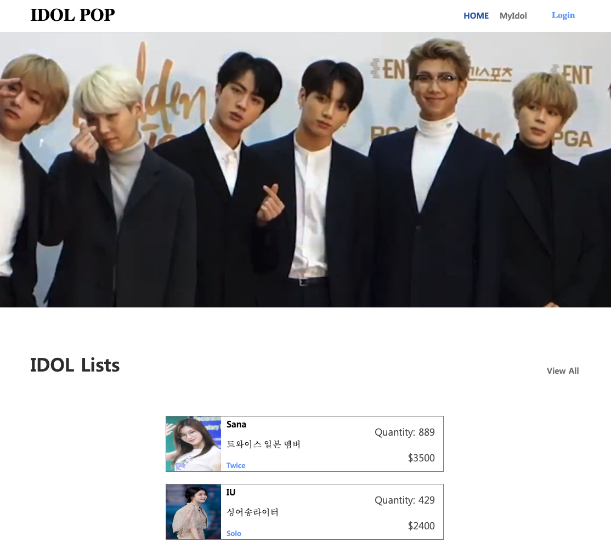
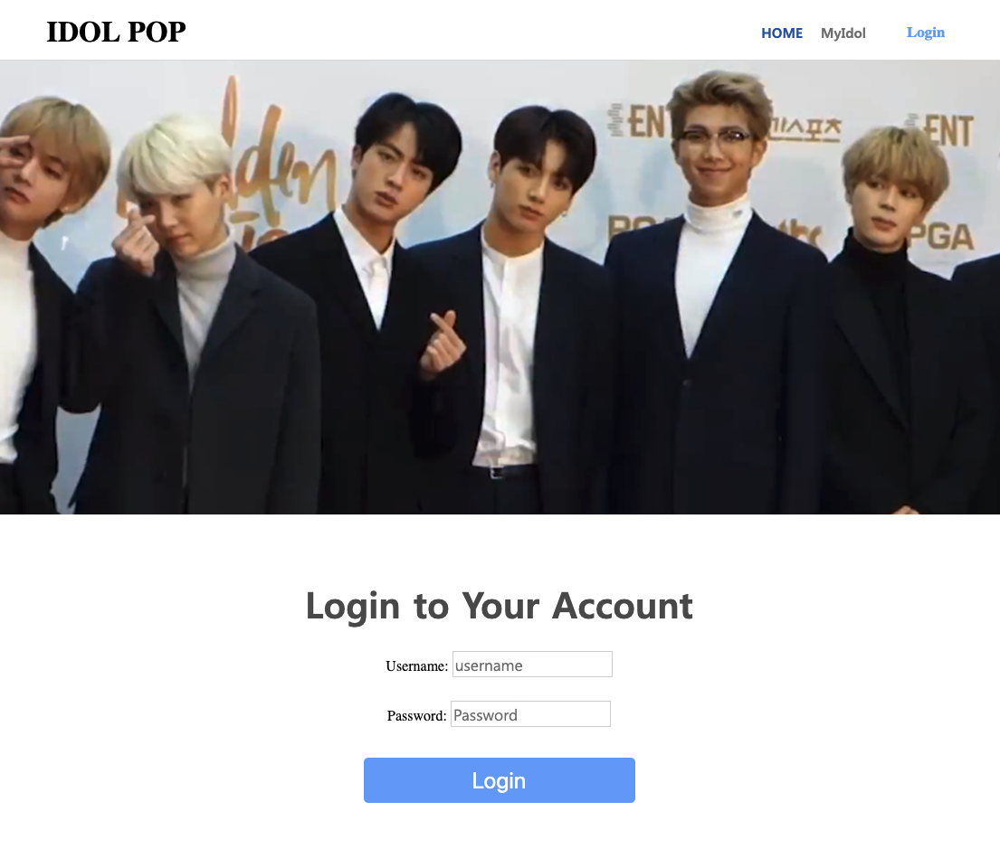

## 클라이언트 연동하기

이제 지금까지 구현한 서버 api를 호출하여 사용하는 클라이언트를 만들어 보겠습니다.

일단 미리 만들어져 있는 `header-footer.html`, `header-footer.css`를 다운받아 `templates` 폴더에 넣어주세요.

header-footer.html: https://drive.google.com/open?id=1A-7xvzIQ7sbj8qwHOSzPLOaqOKEakTXX
header-footer.css: https://drive.google.com/open?id=10LBOnOjeiZOadvEqm7kKRxgC0_3vh17F


### 1. 메인화면 만들기

기존에 작성한 `templates/idol-list.html` 을 활용할 것입니다.
header와 footer는 `header-footer.html` 에서 복사 붙여넣기를 통해 사용해주세요.

이미지는 적당히 넣어주세요.



pages/index.html

```html
<!DOCTYPE html>
<html>

<head>
  <meta charset="utf-8">
  <meta http-equiv="X-UA-Compatible" content="IE=edge">
  <title>IDOL </title>
  <meta name="viewport" content="width=device-width, initial-scale=1.0">
  <link rel="stylesheet" type="text/css" media="screen" href="../css/index.css">
</head>

<body>
  <div class="body">
    <div class="header">
      <div class="header-contents">
        <a href="../pages/index.html" class="logo col-s-6">
          <h1>IDOL POP</h1>
        </a>
        <a href="javascript:void(0);" class="icon col-s-6" onclick="hamburgBarToggle()">
          
        </a>
        <nav id="headerNav" class="topnav">
          <button class="close-button" onclick="hamburgBarToggle()">
            
          </button>
          <div class="nav-items">
            <a href="#" class="active Header-Text">HOME</a>
            <a href="#" class="Header-Text">MyIdol</a>
          </div>
          <a  href="../pages/login.html" class="login-container">
            Login
          </a>
        </nav>
      </div>
    </div>

    <div class="full-width-contents">
      
    </div>

    <div class="contents">
      <div class="idol-lists-container">
        <div class="title view-all-container row-container">
          <div class="Big-Title">IDOL Lists</div>
          <a class="Header-Text" href="javascript:void(0);">
            View All
          </a>
        </div>

        <div class="category">

          <div class="container">
            <div class="img-title-tag-list" id="dynamic-list"></div>
          </div>
        </div>

      </div>

    </div>

    <div class="footer">
      <div class="contents">
        <div class="bottom-container">
          <div class="term">
            <div class="link-container Tab-Selected">
              <a>IDOL POP</a>
            </div>
            <a>jeffgukang@gmail.com</a>
            <div class="row-container">
              <a>Term of Service</a>&nbsp | &nbsp<a>Privacy Policy</a>
            </div>
          </div>
        </div>
      </div>
    </div>
  </div>
</body>
<script>
  function hamburgBarToggle() {
    var x = document.getElementById("headerNav");
    if (x.className === "topnav") {
      x.className += " re sponsive";
    } else {
      x.className = "topnav";
    }
  }
</script>
<script src="../js/parse.min.js"></script>
<script src="../js/parseApis.js"></script>
<script src='../templates/idol-list.js'></script>
<script>
  getIdolList();
</script>

</html>
```

### 2. 로그인 화면 만들기

이제 회원가입, 로그인, 로그아웃 을 적용하도록 하겠습니다.



```html
<!DOCTYPE html>
<html>

<head>
  <meta charset="utf-8">
  <meta http-equiv="X-UA-Compatible" content="IE=edge">
  <title>IDOL </title>
  <meta name="viewport" content="width=device-width, initial-scale=1.0">
  <link rel="stylesheet" type="text/css" media="screen" href="../css/index.css">
  <link rel="stylesheet" type="text/css" media="screen" href="../css/login.css">
</head>

<body>
  <div class="body">
    <!-- 기존 header 부분을 추가합니다. -->

    <div class="full-width-contents">
      
    </div>

    <div class="contents" id="login-body">
      <div class="contents-container">
        <div class="login-form-container col-6 col-s-12">
          <div class="Title-Text">Login to Your Account</div>
          <div class="icinputs-container">
            Username: <input type="text" id="input-username" placeholder="username"
              class="Text-Input input-text input-text-email" />
            <div class="input-help-container">
              Password: <input type="password" id="input-password" placeholder="Password"
                class="Text-Input input-text input-text-password" />
            </div>
          </div>

          <button onclick="signIn()" class="submit Button-Text">
            Login
          </button>

          <br />
          <a  href="../pages/signup.html">
            Do you want to sign up?
          </a>

        </div>
      </div>
    </div>

    <!-- 기존 footer 부분을 추가합니다. -->
</body>
<script>
  function hamburgBarToggle() {
    var x = document.getElementById("headerNav");
    if (x.className === "topnav") {
      x.className += " re sponsive";
    } else {
      x.className = "topnav";
    }
  }
</script>
<script src="../js/parse.min.js"></script>
<script src="../js/parseApis.js"></script>
<script>
  async function signIn() {
    const username = document.getElementById('input-username').value;
    const password = document.getElementById('input-password').value;
    console.log(username, password);

    try {
      const result = await ParseApi.signIn(username, password);
      console.log(result);
      if (result.error) {
        alert(result.error);
      }

      location.href = '../pages/index.html';
    } catch(error) {
      alert(error);
    }
  }
</script>

</html>
```

로그인 스크립트를 살짝 수정하여 에러 메세지가 alert창을 통해 출력되도록 하였습니다.

cs/login.css

```css
@import url(./default.css);
@import url(../templates/header-footer.css);

#login-body {
  display: flex;
    flex-direction: column;
    justify-content: center;
  align-items: center;
  font-family: aritadm;
}

.contents-container {
  max-width: var(--contents-max-width);
  width: 100%;
  min-height: 900px;
  display: flex;
    flex-direction: column;
    align-items: center;
}

.login-form-container {
  display: flex;
    flex-direction: column;
    align-items: center;
    text-align: center;
  margin-top: 71px;
}

.login-form-container .ic_header_logo {
  min-width: 130px;
  align-self: flex-start;
}

.login-form-container .title-text {
  font-family: aritadsb;
  margin-top: 35px;
}

.img-background {
  background: pink;
  background: url(../images/photo.png) no-repeat top left;
  background-size: cover;
}

.icinputs-container {
  width: 100%;
  max-width: 400px;
}

.icinputs-container > * {
  margin-top: 26px;
}

.login-form-container button {
  display: flex;
  flex-direction: row;
  align-items: center;
  justify-content: center;
  width: 300px;
  height: 50px;
  border-radius: 5px;
  background-color: var(--tab-button);
    border: none;
    color: white;
    font-size: 25px;
}

.login-form-container button.submit {
  margin-top: 34px;
}
```

로그인 테스트도 해보세요.

### 3. 회원가입 화면 만들기

기존 login.html과 거의 동일합니다.
pages/signup.html

```html
<!DOCTYPE html>
<html>

<head>
  <meta charset="utf-8">
  <meta http-equiv="X-UA-Compatible" content="IE=edge">
  <title>IDOL </title>
  <meta name="viewport" content="width=device-width, initial-scale=1.0">
  <link rel="stylesheet" type="text/css" media="screen" href="../css/index.css">
  <link rel="stylesheet" type="text/css" media="screen" href="../css/login.css">
</head>

<body>
  <div class="body">
    <div class="header">
      <div class="header-contents">
        <a href="../pages/index.html" class="logo col-s-6">
          <h1>IDOL POP</h1>
        </a>
        <a href="javascript:void(0);" class="icon col-s-6" onclick="hamburgBarToggle()">
          
        </a>
        <nav id="headerNav" class="topnav">
          <button class="close-button" onclick="hamburgBarToggle()">
            
          </button>
          <div class="nav-items">
            <a href="#" class="active Header-Text">HOME</a>
            <a href="#" class="Header-Text">MyIdol</a>
          </div>
          <a  href="../pages/login.html" class="login-container">
            Login
          </a>
        </nav>
      </div>
    </div>

    <div class="full-width-contents">
      
    </div>

    <div class="contents" id="login-body">
      <div class="contents-container">
        <div class="login-form-container col-6 col-s-12">
          <div class="Title-Text">SignUp</div>
          <div class="icinputs-container">
            Username: <input type="text" id="input-username" placeholder="username"
              class="Text-Input input-text input-text-email" />
            <div class="input-help-container">
              Password: <input type="password" id="input-password" placeholder="Password"
                class="Text-Input input-text input-text-password" />
            </div>
          </div>

          <button onclick="signUp()" class="submit Button-Text">
            SignUp
          </button>

          <br />
          <a  href="../pages/login.html">
            Already have account.
          </a>

        </div>
      </div>
    </div>

    <div class="footer">
      <div class="contents">
        <div class="bottom-container">
          <div class="term">
            <div class="link-container Tab-Selected">
              <a>IDOL POP</a>
            </div>
            <a>jeffgukang@gmail.com</a>
            <div class="row-container">
              <a>Term of Service</a>&nbsp | &nbsp<a>Privacy Policy</a>
            </div>
          </div>
        </div>
      </div>
    </div>
  </div>
</body>
<script>
  function hamburgBarToggle() {
    var x = document.getElementById("headerNav");
    if (x.className === "topnav") {
      x.className += " re sponsive";
    } else {
      x.className = "topnav";
    }
  }
</script>
<script src="../js/parse.min.js"></script>
<script src="../js/parseApis.js"></script>
<script>
  async function signUp() {
    const username = document.getElementById('input-username').value;
    const password = document.getElementById('input-password').value;
    console.log(username, password);

    try {
      const response = await ParseApi.signUp(username, password);
      if (response.error) {
        alert(response.error);
      } else {
        console.log(response);
        alert(`Welcome, ${response.result.username} \n SignUp Finished`);
        location.href = '../pages/login.html';
      }
    } catch(error) {
      alert(error);
    }
  }
</script>

</html>
```

signUp 부분으로 변경된 함수들을 유의하세요. 회원가입 성공시 웰컴메시지와 함께 로그인 화면으로 이동시키는 코드입니다.

### 4. 로그아웃 만들기

로그아웃은 기존 login 화면에 추가하도록 하겠습니다.

pages/login.html

```html
<button onclick="signIn()" class="submit Button-Text">
  Login
</button>

<br />
<a  href="../pages/signup.html" class="login-container">
  Do you want to sign up?
</a>

<br />
or
<button onclick="logout()" class="submit Button-Text">
  Logout
</button>
```

`signin()` 하단에 logout 관련 함수 역시 추가해줍니다.

```html
<script>
  ...
async function logout() {
  try {
    Parse.User.logOut();
    location.href = '../pages/index.html';
  } catch(error) {
    alert(error);
  }
}
</script>
```

로그인, 로그아웃을 누르며 로컬 스토리지가 어떻게 변하는지 테스트해보세요.

### 4. 로그인한 유저 정보가 저장되어 있는 경우의 처리

Parse SDK를 쓰면 별도의 세션관리를 하지 않아도 유저가 로그인했을때 그 정보를 Local Storage를 이용하여 저장하고 다른 요청에 사용합니다.

메인 화면에서 유저가 로그인 되어 있는지 확인 한 후 헤더를 변경하는 동작을 구현하도록 하겠습니다.

js/parseApis.js

```js
static checkCurrentUser() {
    const user = Parse.User.current();

    if (user) {
      return user.toJSON();
    } else {
      return false;
    }
  }
```

유저가 존재할경우 유저 정보를 리턴하는 함수입니다.
이제  기존 메인화면에 유저 정보를 체크한 후 유저네임을 헤더에 표시하도록 해보겠습니다.

pages/index.html후

```html
<script>
  getIdolList();

  const user = ParseApi.checkCurrentUser();
  if (user) {
    console.log(user);
    const ele = document.querySelector('.header .login-container')
    ele.innerHTML = user.username;
  }
</script>
```

유저 정보를 확인 후 헤더에 이름을 표시해주는 동작을 수행합니다.

### 5. 아이돌 주식 유저 구매 연동하기

이제 유저가 아이돌의 주식을 구매하면 해당 주식을 유저와 연결하고 리스트로 출력해 보도록 하겠습니다.

앞에서 `purchaseItem` 등 서버에서 필요한 동작은 미리 구현이 되어 있으므로 클라이언트만 구현하면 됩니다.


```js
static async purchaseItem({objectId, count}) {
  try {
    const result = await Parse.Cloud.run('purchaseItem', {objectId, count});
    if (result) {
      return  result.toJSON();
    } else {
      return {};
    }
  } catch (error) {
    throw error;
  }
}
```

기존 idol-list.js에서 생성하는 엘레먼트에 `<button class="buy-button">Buy</button>` 을 추가해줍니다.

templates/idol-list.js

```js
const { name, price, group, description, count, imgUrl,  objectId} = element; // Add objectId

      const html =  `<div class="item row-container" id="${objectId}">` + // Edit this line
        `` +
        `<div class="column-container">` +
            `<div class="title idol-Name">${name}</div>` +
            `<div class="description">${description}</div>` +
            `<div class="tags Hashtag">` +
                `<span class="tag">${group}</span>` +
            `</div>` +
        `</div>` +
        `<div class="column-container subinfo-container">` +
            `<span class="Sub-Text quantity">Quantity: ${count}</span>` + // Add class called quantity
            `<span class="Sub-Text">$${price}</span>` +
        `</div>` +
        `<button class="buy-button" onclick="purchaseItem('${objectId}')">Buy</button>` + // Add this line
    `</div>`;
```

코드를 이해하고 넘어가세요.

templates/idol-list.css 에 css 역시 추가해줍니다.

```css
...
.img-title-tag-list .item .buy-button {
    border: none;
    background: var(--lightish-blue);
    color: white;
    font-size: 20px;
}
```


이제 메인 페이지에서 Buy 버튼을 누를시 서버와의 통신을 하고 정상적으로 응답을 받으면 남은 수량을 수정하는 코드를 짜보도록 하겠습니다.

pages/index.html

```html
<script>
  async function purchaseItem(id) {
    const ele = document.getElementById(id);

    const item = {
      objectId: id,
      count: 1
    }
    try {
      const result = await ParseApi.purchaseItem(item);
      console.log(result);

      ele.querySelector('.quantity').innerHTML = 'Quantity: ' + result.count;
    } catch (error) {
      alert(error);
    }
  }
</script>
```

위 코드는 정상적으로 구매가 될 경우 수량을 갱신하고, 오류 발생시 alert창을 띄우는 코드입니다. 로그아웃 후에 구매시도를 하면 세션 정보(유저 정보)가 지워진 상태이므로 에러 메세지가 뜨는것이 정상입니다.


## 과제

여러 브라우져를 띄워 다른 아이디로 로그인 한 후 동작을 확인해보세요. 서로 다른 유저들이 제품 구매를 할 수 있나요?

지금까지 배운것을 응용하면 여러가지 기능을 구현할 수 있습니다. 그 중 서버에 이미 구현이 되어 있는 API를 활용해 추가적인 작업을 진행해보세요.

### 1. 여러 수량 한꺼번에 구매하기

현재는 한번에 하나의 수량만 구매할 수 있도록 구현이 되어 있습니다. 이것을 갯수를 선택해서 구매할 수 있도록 편집해보세요.
힌트는 idol-list.js, index.html 파일 그리고 `purchaseItem` 함수입니다.

### 2. 유저가 구매한 내역을 화면에 보여주기

유저의 구매 내역을 출력하는 코드는 이미 구현이 되어 있고 Postman을 통해 응답값을 확인할 수 있었습니다.
메인 페이지에 유저의 구매 내역을 출력하는 코드를 작성하고, 로그인되어 있을시 유저의 구매내역을 출력, 구매 후 갱신해보세요.

#### 힌트

parseApis.js에서 사용할 함수
`Parse.Cloud.run('getUserItemList');`

응답값 예시

```json
{
    "result": [
        {
            "createdAt": "2019-02-15T07:28:35.825Z",
            "updatedAt": "2019-02-15T07:36:56.113Z",
            "character": {
                "createdAt": "2019-01-28T08:06:27.564Z",
                "updatedAt": "2019-05-05T09:33:06.716Z",
                "name": "Sana",
                "imgUrl": "https://aa.com/abc.jpg",
                "price": 3500,
                "count": 888,
                "description": "트와이스 일본 멤버",
                "group": "Twice",
                "objectId": "UKA8o2SXnG",
                "__type": "Object",
                "className": "Character"
            },
            "user": {
                "__type": "Pointer",
                "className": "_User",
                "objectId": "dSsLEEJQQA"
            },
            "count": 11,
            "objectId": "eu2AnRLqdp",
            "__type": "Object",
            "className": "UserCharacter"
        },
        {
          ...
        }
    ]
}
```
