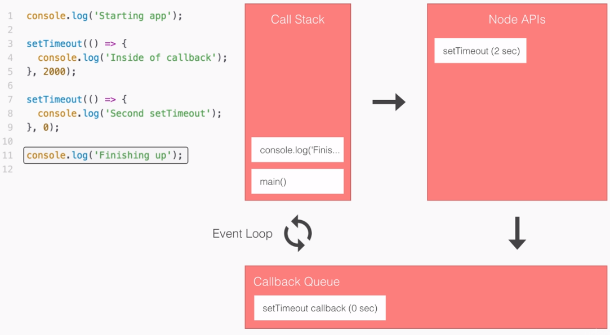
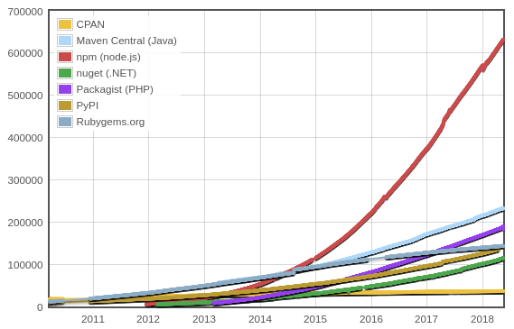

# NodeJS로 API 서버 구축하기 (NodeJS 및 PostgreSQL 설치 튜토리얼)

작성자: [Jeff Gu Kang](https://github.com/JeffGuKang/)

이 튜토리얼은 NodeJS 환경을 기본으로 합니다.
AWS에서 RDS로 PostgreSQL을 지원하기 때문에 PostgreSQL을 사용하겠습니다.

1. DB로 PostgreSQL 설치
2. Parse-Server용 PostgreSQL database 생성
3. Parse-Server 실행
4. Postman을 통해 동작 테스트
5. Parse-Dashboard를 통해 데이터베이스 확인

windows에서는
`npm install -g win-node-env`
를 통해 env 입력을 받을 수 있도록 해주세요.

## NodeJS란?

https://nodejs.org
> Node.js® is a JavaScript runtime built on Chrome's V8 JavaScript engine.

자바스크립트 언어를 구동할수 있게 해주는 런타임, 구글의 오픈소스인 V8 자바스크립트 엔진을 기반으로 합니다.

기존엔 브라우져 상에서만 동작 가능했던 Javascript 언어를 다양한 곳에서 활용할수 있게 해주었습니다.

### 1. V8 Engine

브라우져의 자바스크립트 엔진에는 여러종류가 있지만 NodeJS는 구글 크롬과 동일한 V8 엔진 기반으로 동작합니다. 오픈 소스로 공개된 V8 엔진은 독립적으로 실행할 수 있으며 계속 발전해 나가고 있습니다.

### 2. Non-Blocking I/O

파일이나 HTTP 요청을 읽고 쓰는, Input / Output, 작업에서 순차적으로 요청들을 처리하고 출력하는 방식인 Blocking 방법에 비해  비동기적으로 여러 요청들을 처리하고 그때 그때 출력해줄 수 있습니다.


<What exactly is Node.js? — Priyesh Patel, freecodecamp.org >

user1, user2의 정보에 대한 요청과 sum이라는 요청이 들어왔을 경우 왼쪽의 Blocking I/O 방식의 경우 user1, user2의 요청이 완료될때까지 다음 요청은 오랜 시간을 기다려야 하는 것을 볼 수 있습니다. 하지만 Non-Blocking I/O 방식에서는 들어오는 요청을 대기없이 바로 시작하며 결과가 나오는 순간 다른 요청과 상관없이 즉각적으로 결과를 출력할 수 있는 것을 볼 수 있습니다.


### 3. Event-Driven

Event-Driven이란 이벤트(또는 객체의 상태 변화)에 따라 프로그램의 실행을 제어하는 구현 방식을 말합니다. 일반적으로 어떤 이벤트가 발생하는지 살펴보고 있다가 해당 이벤트가 발생했을 때, 원하는 작업(또는 콜백 함수)을 실행하는 것을 의미합니다. 실생활의 예로 보면 은행에 자동이체를 등록하는 상황을 생각할 수 있습니다. 25일에 월급이 입금되기 때문에 월급이 입금(이벤트 발생, 통장 상태 변화)되면, 각종 대출과 적금, 공과금을 내도록(원하는 작업, 콜백 함수 실행) 등록해두면 매월 자동으로 이체가 실행되는 것입니다. Node.js는 이러한 비동기 작업 (Non-Blocking I/O 등)을 구현하기 위해서 내부적으로 Event Loop를 이용하고 있습니다.


< Learning Node.js Development — Andrew Mead >

Event Loop는 프로그램의 작업 목록(Call Stack)이 비어있는지를 지켜보고 있다가 작업이 모두 실행되어 비어 있는 상태가 되면 이벤트 콜백 목록(Callback Queue)에 담긴 콜백을 하나씩 꺼내 작업 목록으로 가져와 처리합니다. 위의 그림 왼쪽의 코드를 언뜻 보면 ‘Starting app’, ‘Inside of Callback’, ‘Second SetTimeout’, ‘Finishing up’ 순서로 출력되도록 구현한 것처럼 보입니다. 그런데 실제로 프로그램은 작업 목록(Call Stack)에 바로 들어온 ‘Starting app’, ‘Finishing up’을 먼저 출력합니다. 다음으로 7번 라인에서 등록한 이벤트가 (0초 이후) 발생해서 콜백 목록(Callback Queue)으로 이동하여 대기하다가, 작업 목록(Call Stack)이 비는 순간 Event Loop에 의해 작업 목록(Call Stack)으로 이동하여 ‘Second setTimeout’이 출력됩니다. 2초(2000ms) 이후에 방금과 같은 순서로 3번 라인에서 등록한 이벤트도 실행되어 ‘Inside of callback’이 출력됩니다.

Node.js는 대부분 I/O와 내부 모듈들을 이벤트 형태로 구현해 제공합니다. 덕분에 개발자는 오래 걸리는 작업 여러 가지를 동시적(Concurrently)으로 요청해 처리할 수 있습니다. Event Loop와 Non-Blocking I/O 덕분에 서버와 같은 프로그램이 수많은 요청을 동시에 요청을 처리할 수 있게 되었고, Node.js로부터 Multi-threading의 필요성을 제거했습니다.

### 4. Node Package Manager

방대한 양의 모듈들을 인스톨하여 사용할 수 있고, 관리가 편리합니다.

< Module Counts Graph — http://www.modulecounts.com/ >

빠른 속도로 증가하고 있어 다른 어떤 환경보다 많은 모듈을 무료로 제공합니다. 자신이 모듈을 만들어 올릴 수도 있습니다. Facebook의 iOS/Android 개발 프레임워크인 React Native도 이러한 NodeJS 환경을 통해 개발되고 있습니다.

## NodeJS 환경 설치

- 공식: https://nodejs.org/en/download/package-manager/
- [Ubuntu](https://www.digitalocean.com/community/tutorials/how-to-install-node-js-on-ubuntu-18-04)

다음 명령어를 통해 NodeJS를 설치합니다.

```
sudo apt update
```

```
sudo apt install nodejs
```

```
nodejs -v
```

npm이 설치되어 있지 않는 경우

```
sudo apt install npm
```
