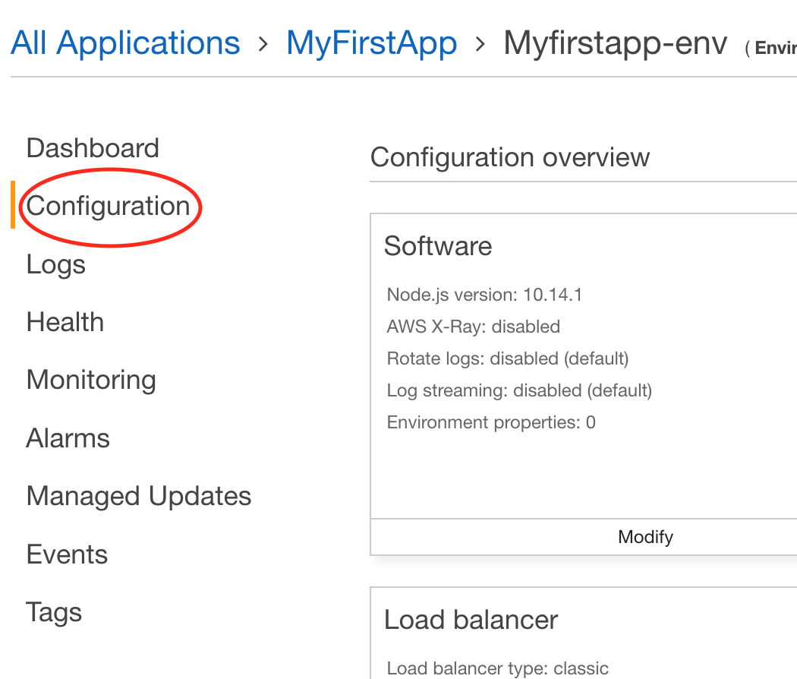
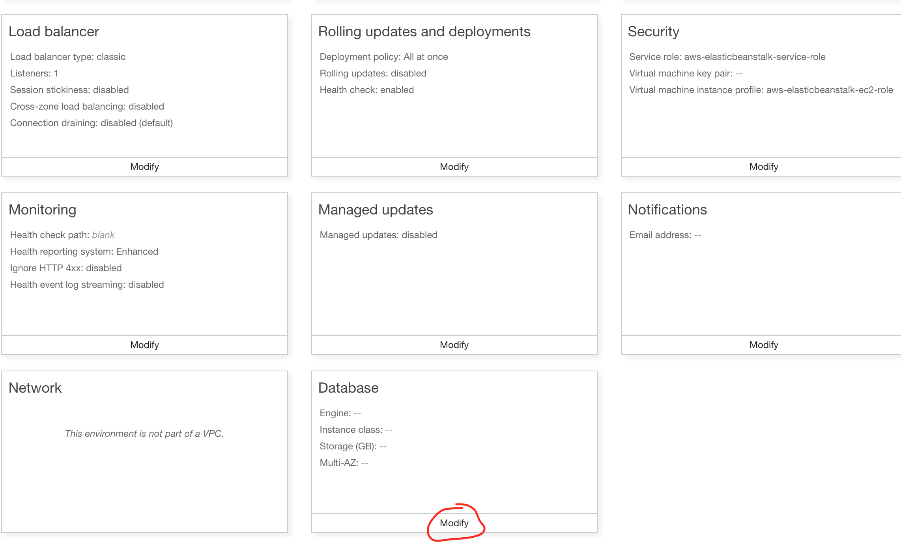
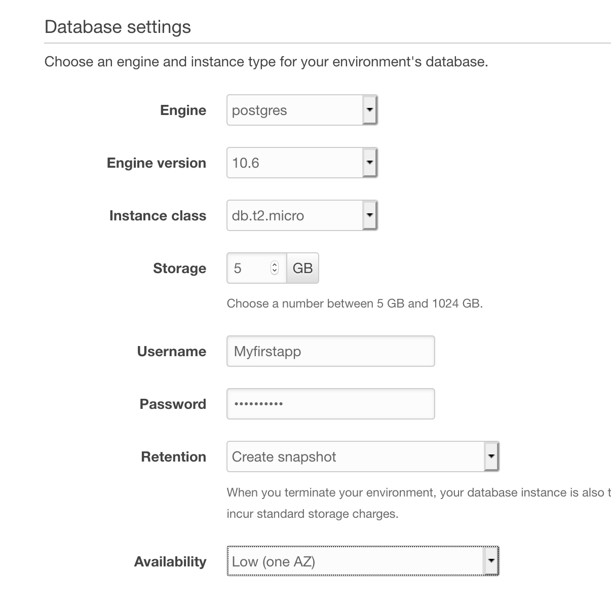
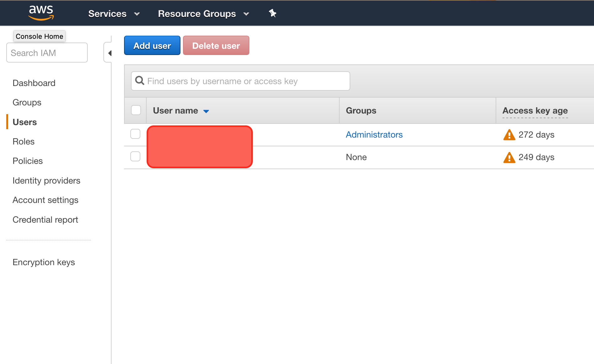
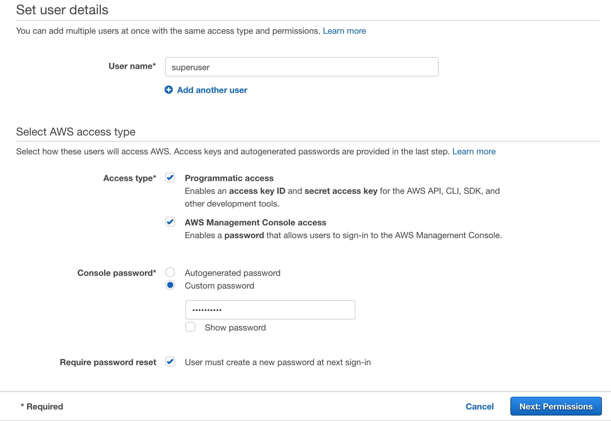
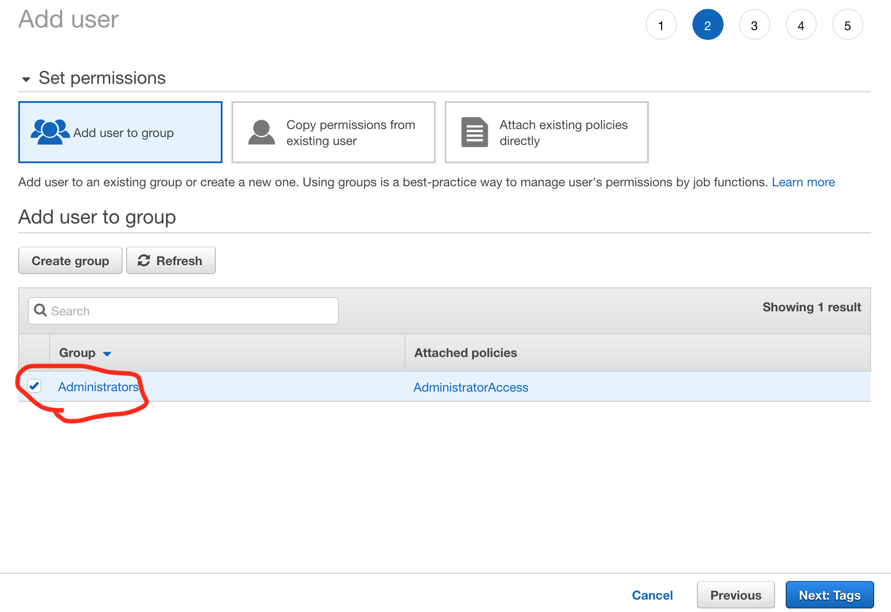
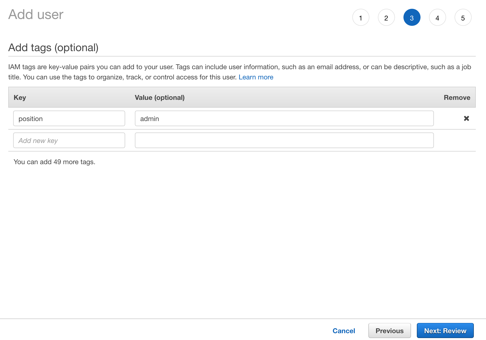
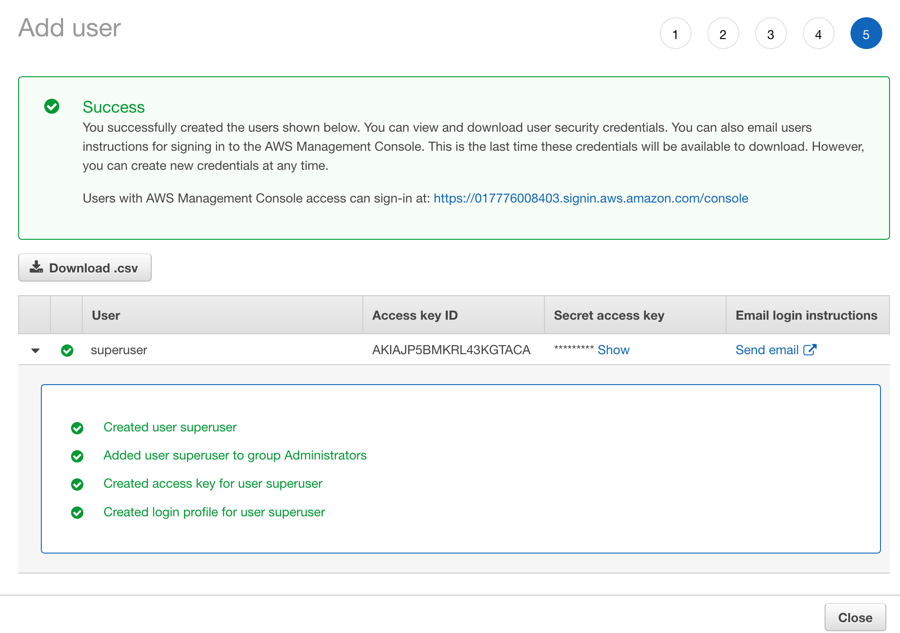
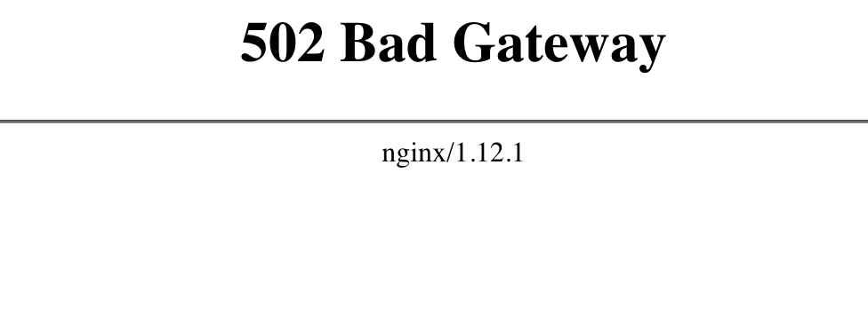
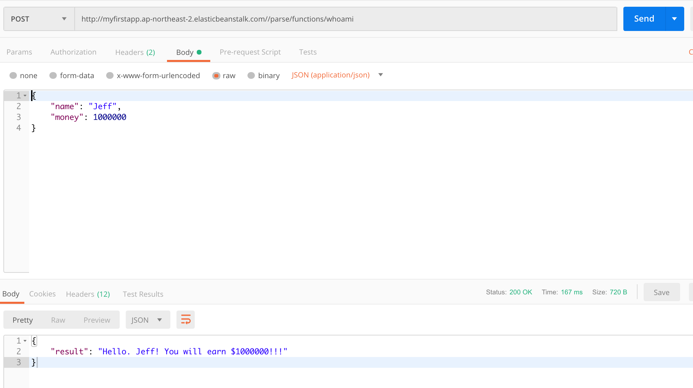

# 로컬에 구축한 서버 환경을 AWS EB로 배포 및 테스트

작성자: [Jeff Gu Kang](https://github.com/JeffGuKang/)

앞에 튜토리얼에 이어 로컬에 구축한 환경을 AWS Elasticbeanstalk로 배포하여 실제 운영 가능한 백엔드 서버로 사용해보도록 하겠습니다.

1. AWS 콘솔을 통한 Elastic Beanstalk 앱생성 및 RDS 설정
2. EB CLI를 통한 앱 연결 및 세부 설정
3. 로컬에 있는 프로젝트 AWS EB로 배포하기
4. 프록시 서버
5. 실제 서버 동작 테스트

## AWS 콘솔을 통한 Elastic Beanstalk 앱 생성

위 과정은 [처음 튜토리얼](./README.md)과 동일하다. 여기서는 처음 튜토리얼에서 만든 MyFirstapp 이라는 환경을 계속 사용합니다.

## RDS 설정

### RDS란

> Amazon Relational Database Service(Amazon RDS)는 클라우드에서 관계형 데이터베이스를 더 쉽게 설치, 운영 및 확장할 수 있는 웹 서비스입니다. 이 서비스는 산업 표준 관계형 데이터베이스를 위한 경제적이고 크기 조절이 가능한 용량을 제공하고 공통 데이터베이스 관리 작업을 관리합니다. [공식문서](https://docs.aws.amazon.com/ko_kr/AmazonRDS/latest/UserGuide/Welcome.html)

RDS는 특정 앱 서버 환경에 종속되지 않는 별도의 데이터베이스입니다. 별도로 관리가 가능하기 때문에 DB만 따로 백업, 확장, 복원 등을 편리하게 할 수 있습니다.

### EB에 RDS 생성

Elastic Beanstalk에서는 EC2 인스턴스를 사용하여 컴퓨팅 자원을 사용하게 됩니다. 저번 [튜토리얼](./Tutorial1.md)에 로컬에 PostgreSQL을 설치하여 사용한 것 처럼 프로젝트 소스가 올라가는 EC2 인스턴스에 바로 DB를 설치해서 사용하는 방법이 있지만 저희는 별도로 DB를 구성하여 백업, 관리, 확장성에 있어 이점을 가져가보도록 하겠습니다.

1. 미리 만들어놓은 EB의 앱 환경을 여시고 Congifuration -> 하단의 Database 항목으로 가 Modify를 통해 수정을 합니다.



2. 하단에 Database 항목 수정



3Modify를 서택한 후 아래와 같이 설정을 합시다. Password같은 경우는 개인이 잘 관리하셔야합니다.

- Engine: PostgreSQL
- Engine Version: 10.6
- Instance class: db.t2.micro
- Storage: 5GB
- Username: YOUR_USER_NAME
- Password: YOUR_PASSWORD
- Retention: Create Snapshot
- Availability: Low or High



배포시 Availability: High(Multi AZ)를 선택하면 DB 장애시 자동으로 생성되고 관리되는 예비 복제본을 사용하여 서비스를 유지시킬 수 있습니다. 물리적인 스토리지를 하나 더 생성하기 때문에 비용이 조금 더 올라가니 실 서비스 운영시 고려해보세요.

4. 설정 후 Apply를 누르면 RDS가 생성되어 EB에 연결이 됩니다.
   대쉬보드에 있는 Event Log에 다음 메세지를 확인할 수 있습니다.

> Creating RDS database named: aa1o9u888xywzge. This may take a few minutes.

생성된 RDS는 자동적으로 환경변수를 통해 접속할 수 있습니다.

- **RDS_HOSTNAME** – DB 인스턴스의 호스트 이름입니다.

  Amazon RDS 콘솔 레이블 – 엔드포인트(호스트 이름)

- **RDS_PORT** – DB 인스턴스가 연결을 허용하는 포트입니다. 기본값은 DB 엔진마다 다릅니다.

  Amazon RDS 콘솔 레이블 – 포트

- RDS_DB_NAME – 데이터베이스 이름(ebdb)입니다.

  Amazon RDS 콘솔 레이블 – DB Name(DB 이름)

- RDS_USERNAME – 데이터베이스에 대해 구성된 사용자 이름입니다.

  Amazon RDS 콘솔 레이블 – 사용자 이름

- RDS_PASSWORD – 데이터베이스에 대해 구성된 암호입니다.

Example

```js
const hostname = process.env.RDS_HOSTNAME;
```

위 방법 말고 EB에 종속되지 않는 별도 RDS를 생성하고 연결도 가능합니다. 링크를 참조하세요.
[RDS 별도 생성 및 연결](https://docs.aws.amazon.com/ko_kr/elasticbeanstalk/latest/dg/AWSHowTo.RDS.html)

### 기존 프로젝트에 RDS 적용

외부 DB를 만들었으니 배포용 소스에 적용을 해 보겠습니다. Tutorial1에서 생성한 프로젝트의 index.js에 미리 정의되어 있으니 확인을 해봅니다.

index.js

```js
if (process.env.NODE_ENV !== 'local') {
  databaseURI = `postgres://${process.env.RDS_USERNAME}:${process.env.RDS_PASSWORD}@${process.env.RDS_HOSTNAME}:${process.env.RDS_PORT}/${process.env.RDS_DB_NAME}`;
}
```

## EB CLI를 통한 앱 연결 및 세부 설정

Tutorial1에서 프로젝트 소스를 압축하여 서버에 배포를 하였습니다. 이러한 과정은 손이 많이 가고 효율이 떨어지므로 EB Cli를 이용하여 편리하게 배포하는 방법을 사용합니다.

### Elastic Beanstalk 명령줄 인터페이스(EB CLI)

AWS EB에서 제공하는 CLI(Command Line Interface)입니다. 콘솔보다 더 세세한 컨트롤이 가능하고 스크립트 등을 이용하여 다양하게 활용할 수 있습니다.

### Elastic Beanstalk 명령줄 인터페이스(EB CLI) 설치

[공식 설치법](https://docs.aws.amazon.com/ko_kr/elasticbeanstalk/latest/dg/eb-cli3-install.html)

Python을 기반으로 pip를 사용하여 설치됩니다. Python을 설치하면 pip를 사용할 수 있습니다.

- [Python 설치](https://www.python.org/downloads/)

윈도우 설치는 [프시켓님 글](https://medium.com/@psychet_learn/python-%EA%B8%B0%EC%B4%88-2%EC%9E%A5-python-%EC%84%A4%EC%B9%98-%EB%B0%8F-%ED%99%98%EA%B2%BD%EC%84%A4%EC%A0%95-windows-ver-b030d96bcbd0)
를 참고하세요.

윈도우는 python3.7 사용자인 경우 윈도우키 누르고 ->환경 변수 설정 -> 시스템 환경 변수 설정 ->에서
`%USERPROFILE%\AppData\roaming\Python\Python37\scripts`
를 추가해주시면 됩니다. 다만 윈도우 환경에 따라 설치되는 폴더가 위 경로와 다른 경우가 빈번하오니 주의하세요.(안되면 issue 등으로 남겨주세요) 파이썬 버전에 주의하세요.

EB CLI 설치

```sh
$ pip install awsebcli --upgrade --user
```

## EB CLI 사용을 위한 IAM 계정 생성

### IAM이란

AWS Identity and Access Management의 약자로서 액세스 키를 사용하여 AWS API 작업을 프로그래밍 방식으로 호출하거나 AWS CLI 명령을 사용할 수 있도록 합니다. - [IAM](https://docs.aws.amazon.com/ko_kr/general/latest/gr/aws-sec-cred-types.html#access-keys-and-secret-access-keys)

[IAM Console](https://console.aws.amazon.com/iam/home#/home) 을 통해 EB CLI를 사용할때 쓸 수 있는 계정을 생성해보도록 하겠습니다.



### IAM을 통한 유저 생성

1. Add User를 눌러 새로운 계정을 만듭니다.

- **User name**: 여기서는 superuser를 사용합니다.
- **Programmatic access**: 해당 유저에게 CLI를 사용해줄 수 있게 합니다. Access key와 secret key가 제공됩니다.
- **AWS Management Console access**: 이 계정을 사용해 별도로 콘솔에 로그인이 가능합니다.



2.  권한설정 - Next:Permission 버튼을 눌러 권한설정으로 넘어갑니다.
   여기서는 Admin 그룹을 선택하여 모든 권한을 주도록 하겠습니다.



3. 태그 추가
   선택 항목으로서 여기서는 여러명의 유저 혹은 팀원이 사용한다면 역할에 따라 구분하기 쉽도록 position이란 태그를 추가해 보았습니다.



4. Review 후 Create user 버튼을 눌러 새로운 유저를 생성합니다.

로컬환경에 Acess Key와 Secret access key를 등록하여 EB CLI를 사용할 것입니다. Secret access key는 비밀스럽게 잘 적어두세요.



이제 CLI를 사용할 수 있는 유저를 생성하고 Access Key와 Secret Key를 발급받았습니다.

## EB CLI를 사용하여 로컬환경에 EB 정보 추가

이제 EB CLI를 사용할 준비가 되었습니다. 다음 과정을 통해 EB 설정을 해봅시다.

이 과정에서는 git이 기본적으로 프로젝트에 설정되어 있다고 가정을 합니다. 앞 [튜토리얼](./Tutorial1.md)에서 git clone을 통해 프로젝트를 받은 경우 기본적으로 git이 설정된 상태입니다. 다만 zip 으로 받은 경우 git init을 통한 git 초기화가 필요합니다.

1. 프로젝트 폴더에서 터미널 명령어를 통해 초기화를 합니다.

```sh
~/eb $ eb init
Select a default region
1) us-east-1 : 미국 동부(버지니아 북부) 2) us-west-1 : 미국 서부(캘리포니아 북부 지역) 3) us-west-2 : 미국 서부(오레곤) 4) eu-west-1 : EU(아일랜드) 5) eu-central-1 : EU(프랑크푸르트) 6) ap-south-1 : 아시아 태평양(뭄바이) 7) ap-southeast-1 : 아시아 태평양(싱가포르) 8) ap-southeast-2 : 아시아 태평양(시드니) 9) ap-northeast-1 : 아시아 태평양(도쿄) 10) ap-northeast-2 : 아시아 태평양(서울) 11) sa-east-1 : 남아메리카(상파울루) 12) cn-north-1 : 중국(베이징) 13) cn-northwest-1 : 중국(닝샤) 14) us-east-2 : 미국 동부(오하이오) 15) ca-central-1 : 캐나다(중부) 16) eu-west-2 : EU(런던) 17) eu-west-3 : EU(파리)
(default is 3): 3
```

기존에 만든 EB App의 Region을 선택합니다. 여기서 서울은 10번입니다. (변경 가능성이 있으니 확인하세요.)

2. EB CLI가 리소스를 관리할 수 있도록 IAM을 통해 앞에서 생성한 유저의 access key와 secret key를 입력합니다.

```sh
You have not yet set up your credentials or your credentials are incorrect.
You must provide your credentials.
(aws-access-id): YOUR_ACCESS_ID
(aws-secret-key): YOUR_SECRET_KEY
```

3. EB Appplication 생성 혹은 연결

기존에 생성한 Application 리스트가 보이므로 기존것을 사용하도록 하겠습니다.

```sh
Select an application to use
1) MyFirstApp
2) BubbleTalk
3) [ Create new Application ]
(default is 3): 1
```

4. CodeCommit 사용 선택

저희는 별도의 AWS 코드관리를 사용하지 않고 Git만 주력으로 사용하겠습니다.

```sh
Do you wish to continue with CodeCommit? (y/N) (default is n): n
```

5. 생성된 설정파일 확인

위 과정을 끝낸 후 `.elasticbeanstalk/config.yml`에 생성된 파일을 열어보면 EB Init을 통해 설정한 내용을 확인할 수 있습니다.

```yml
branch-defaults:
  master:
    environment: Myfirstapp-env
environment-defaults:
  Myfirstapp-env:
    branch: null
    repository: null
global:
  application_name: MyFirstApp
  default_ec2_keyname: null
  default_platform: arn:aws:elasticbeanstalk:ap-northeast-2::platform/Node.js running
    on 64bit Amazon Linux/4.7.1
  default_region: ap-northeast-2
  include_git_submodules: true
  instance_profile: null
  platform_name: null
  platform_version: null
  profile: null
  sc: git
  workspace_type: Application
```

EB Cli를 통한 설정은 여기까지입니다. 다음은 바로 배포를 해보도록 하겠습니다.

## EB CLI을 통한 AWS 서버에 프로젝트 배포

배포는 `eb init`을 통해 설정을 해놓은 프로젝트 폴더에서 `eb deploy`를 통해 실행됩니다.

deploy 명령어를 통해 마지막 commit 기준으로 프로젝트를 서버에 업로드하여 배포할 수 있습니다.

`eb deploy` 라는 명령어를  수행하면  해당 프로젝트를 압축하여  EB Application으로 인해 생성된 AWS S3에 업로드 후 배포하는 방식으로 동작합니다. - [eb deploy](https://docs.aws.amazon.com/elasticbeanstalk/latest/dg/eb3-deploy.html)

일단 배포를 실행하기 전에 `.ebextensions/02_nginx_proxy.config` 파일을  프로젝트에서 삭제하도록 하겠습니다. (다른곳에 백업해놓으세요.)

그 후 git commit을 한 후 배포를 합니다.

```sh
$ git add .
$ git commit -m 'Delete nginx_proxy config'
$ eb deploy


Creating application version archive "app-e54a-190122_170223".
Uploading MyFirstApp/app-e54a-190122_170223.zip to S3. This may take a while.
Upload Complete.
2019-01-22 08:02:24    INFO    Environment update is starting.
2019-01-22 08:03:03    INFO    Deploying new version to instance(s).
2019-01-22 08:04:02    INFO    New application version was deployed to running EC2 instances.
2019-01-22 08:04:02    INFO    Environment update completed successfully.
```

정상적으로 배포가 되었습니다.

여기서  eb deploy를 하기까지의 동작 순서를 잠깐 되짚어보면 

1. AWS IAM에서 CLI를 통해 AWS를 컨트롤 할 수 있는 계정 생성 및 컴퓨터에 정보 저장
2. 프로젝트 폴더에서 `eb init`을 통해 계정 기준으로 elastic beanstalk 정보 설정
3. `eb deploy`를 통해 최근 commit 시점의 소스를 AWS에 업로드

이제 Application 환경의 url로 접속해봅시다.



접속이 되지 않습니다. 다음 장에서 문제를 해결해보죠.

### EB 프록시 서버 구성(NginX)


AWS EB에서 NodeJS 기반의 플랫폼으로 환경을 구성하면 기본적으로 NginX 프록시가 설치되어 있는 환경이 됩니다. 기본설정을 사용하면 웹사이트 접속(80포트)을 8081 포트로 전달하기 때문에 현재 우리가 index.js에서 설정해놓은 1337포트로 접근할 수가 없습니다.

> Node.js 플랫폼은 역방향 프록시를 사용하여 인스턴스에서 포트 80의 요청을 포트 8081에서 수신 중인 애플리케이션으로 전달합니다. Elastic Beanstalk는 확장하거나 자체 구성으로 완전히 재정의할 수 있는 기본 프록시 구성을 제공합니다. - [EB 프록시 서버](https://docs.aws.amazon.com/ko_kr/elasticbeanstalk/latest/dg/nodejs-platform-proxy.html)

`.ebextensions` 폴더의 설정을 통해 NginX 구성을 변경할 수 있습니다.
프로젝트에 미리 설정되어져 있던 02_nginx_proxy.config를 보면 외부에서 들어오는 접속(80)을 1337 포트로 전달하는것을 볼 수 있습니다. 추가적으로 `dashboard`도  선언되어 있는것을 볼 수 있네요.

```yml
files:
    "/etc/nginx/conf.d/02_nginx_proxy.conf" :
        mode: "000755"
        owner: root
        group: root
        content: |
            upstream parseserver {
                server 127.0.0.1:1337;
                keepalive 256;
            }

            server {
                listen 8080 default_server;

                if ($time_iso8601 ~ "^(\d{4})-(\d{2})-(\d{2})T(\d{2})") {
                    set $year $1;
                    set $month $2;
                    set $day $3;
                    set $hour $4;
                }
                access_log /var/log/nginx/healthd/application.log.$year-$month-$day-$hour healthd;
                access_log  /var/log/nginx/access.log  main;

                location / {
                    proxy_pass  http://parseserver;
                    proxy_http_version 1.1;
                    proxy_set_header        Host            $host;
                    proxy_set_header        X-Real-IP       $remote_addr;
                    proxy_set_header        X-Forwarded-For $proxy_add_x_forwarded_for;

                    # For Websocket
                    proxy_set_header Upgrade $http_upgrade;
                    proxy_set_header Connection "upgrade";
                }

                location /dashboard {
                        proxy_set_header X-Real-IP $remote_addr;
                        proxy_set_header X-Forwarded-For $proxy_add_x_forwarded_for;
                        proxy_set_header X-Forwarded-Proto https;
                        proxy_pass http://parseserver/dashboard;
                        proxy_set_header Host $host;
                }

                gzip on;
                gzip_comp_level 4;
                gzip_types text/plain text/css application/json application/javascript application/x-javascript text/xml application/xml application/xml+rss text/javascript;

                location /static {
                    alias /var/app/current/static;
                }

                include conf.d/elasticbeanstalk/*.conf;
            }
```

위 파일을 다시 `.extensions` 폴더에 넣어 처음 프로젝트 상태로 되돌립니다.

`.ebextensions/nodecommand.config`에서는 프로젝트가 서버에 업로드 된 후 실행되는 커맨드를 지정해 주었습니다. 여기서 `npm install`은 EB의 NodeJS 환경에서 자동으로 실행되므로 별도로 지정해주지 않아도 되며, 추가적으로 별도의 명령어가 없다면 `npm start`도 자동으로 실행되지만 여기서는 명시를 해 주었습니다.

```
option_settings:
  aws:elasticbeanstalk:container:nodejs:
    NodeCommand: "npm start"
```

### `.npmrc` 설정

.npmrc 파일에는 가끔 모듈이 요구하는 권한 때문에 설치가 되지 않는 경우를 피하기 위해 권한을 무시하는 옵션을 넣어놨습니다.

```js
unsafe-perm=true
```

### 재배포

위 과정을 완료한 후 다시 `eb deploy`로 재 배포를 하면 정상적으로 local때와 같이 서버가 동작하는 것을 볼 수 있습니다. 다른점은 실제 서버에서 프로젝트가 동작하고 있기 때문에 localhost:1337 주소 대신 `http://myfirstapp.ap-northeast-2.elasticbeanstalk.com/` 이런 형식의 주소로 접속이 가능하다는 점입니다.

마찬가지로 Parse-Dashboard도
`http://myfirstapp.ap-northeast-2.elasticbeanstalk.com/dashboard`와 같은 url을 통해 접속할 수 있습니다. 접속해서 이리저리 둘러보세요.

### Postman을 통한 테스트

자 이제 어떻게 테스트할 수 있을까요?
local과 다른 점은 주소 뿐입니다. 기존 Postman에서 테스트하던 API 접속 주소를 실제 서버 주소로 변경해주면 동작하겠죠?




## Conclusion

이제 Parse Server를 실 서버로 배포가 끝났습니다.

- AWS 콘솔을 통한 Elastic Beanstalk 앱생성
- EB에서 사용할 별도 데이터베이스 설정(RDS)
- IAM을 통한 어드민 권한의 계정 생성
- EB CLI를 통한 Application 연결 및 세부 설정
- EB CLI를 통해 로컬에 있는 프로젝트 AWS EB로 배포하기
- 프록시 서버
- 실제 서버 동작 테스트

의 과정을 진행하였습니다. 여기까지 왔으면 실제 서비스에서 사용할 수 있는 벡엔드를 구축한 것입니다!! 다음은 실제로 Parse Server를 수정해보고 API 호출을 통해 벡엔드 데이터를 컨트롤해보도록 하곘습니다.