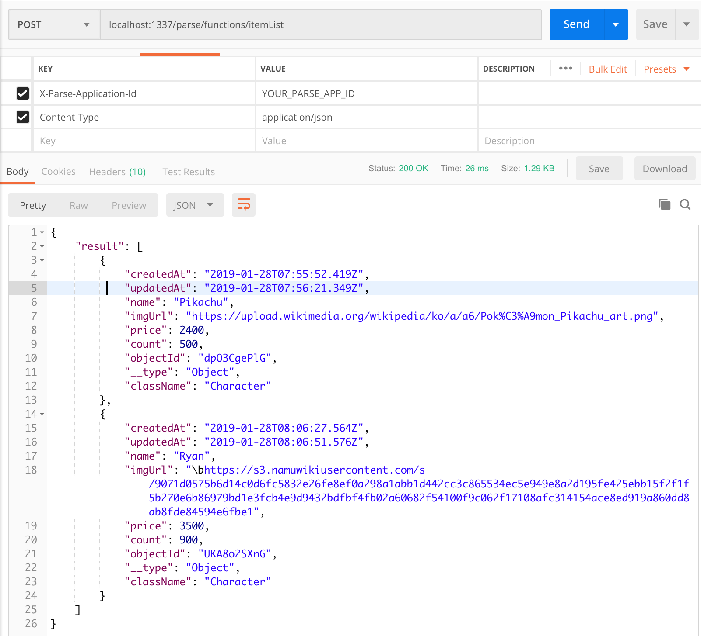

# API 서버 구현 및 프론트엔드와 통신하기

(example3)

## 데이터베이스 사용하기

현재까지는 데이터베이스를 사용하지 않고 Parse Server를 다뤄 봤습니다.


## 애플리케이션에서 서버 API를 호출하여 백엔드 데이터베이스 수정하기

백엔드 서버를 사용하는 일반적은 서비스들은 클라이언트에서 서버의 API를 호출하고 데이터베이스 관련 작업은 백엔드에서 전담하는 경우가 많습니다.

이번 챕터에서는 백엔드에서 데이터베이스를 업데이트하는 api를 추가하고 클라이언트에서 그것을 호출하여 응답을 처리하는 과정을 진행해 보겠습니다.


대략적으로 상품 리스트가 있고 유저가 특정 상품을 구매하는 형식의 애플리케이션을 구상해보았습니다.

### 데이터베이스에 상품 리스트 추가하기

캐릭터에 대한 가상 주식을 상품으로 정하고 데이터베이스에 해당 내역을 추가해보도록 하겠습니다.

간단하게 이름, 이미지주소, 가격, 개수로 데이터베이스 스키마를 구성하였습니다.

Character

- name
- imgUrl
- price
- count

예를 들면

- name: Sana
- imgUrl: https://upload.wikimedia.org/wikipedia/ko/a/a6/Pok%C3%A9mon_Sana_art.png
- price: 2400
- count: 500

이런 식입니다.

#### 1. 로컬에서 parse dashboard 실행

로컬 데이터베이스에 해당 데이터 구조를 생성해 보겠습니다.
현재 로컬로 실행되고 있는 parse server 프로젝트에서 미리 작성된 `npm run dashboard:local` 스크립트를 통해 Parse Dashboard를 실행합니다. 오리지날 커맨드는 `parse-dashboard --config parse-dashboard-config-local.json` 입니다.

```s
$ npm run dashboard:local

> parse-dashboard --config parse-dashboard-config-local.json

The dashboard is now available at http://0.0.0.0:4040/
```

Parse Server 설정값인 `config/default.json` 파일의 appId, masterKey 등이 `parse-dashboard-config-local.json` 파일과 일치해야 정상실행됩니다.

정상 실행 후 `http://0.0.0.0:4040/` 주소를 통해 대쉬보드를 접속할 수 있습니다.


Parse Server에서 기본적으로 생성하는 User 클래스와 Role이 보입니다. 현재 로컬 데이터베이스인 PostgreSQL를 Parse Dashboard를 통해 보여주고 있다고 생각하셔도 무방합니다. (실제로는 Parse Server를 통하기 때문에 조금 다른 개념입니다. )

#### 2. 새로운 클래스 생성하기

이제 좌측 사이드바에 있는 Create a class 버튼을 통해 새로운 클래스를 생성합니다. 지금 사용하고 있는 Parse Dashboard는 Parse Server의 master key를 사용하고 있기 때문에 클래스 생성, 삭제, 수정 등의 관리자 권한이 필요한 동작이 가능합니다.
master key 설정값은 `config/default.json` 및 `parse-dashboard-config-local.json`를 참고하세요.

새로 생성할 클래스 이름은 Character로 정하겠습니다.


생성된 Character 클래스를 보면 기본적으로 생성되어 있는 columns은 다음과 같습니다.

- objectID: 고유 ID
- createAt: 생성 시간
- updatedAt: 업데이트 시간
- ACL: 권한 관련


이제 여기에 새로운 columns을 생성하겠습니다.

- name: String
- imgUrl: String
- price: Number
- count: Number
- description: String
- group: String

`Add a new column` 버튼 혹은 `Edit -> Add a row`를 통해 위 column들을 각각 생성해줍니다. type 선택에 유의하세요.


#### 3. 데이터 입력하기


Add Row 버튼을 통해 데이터를 입력합니다. 해당 column에서 더블클릭으로 입력 가능합니다.


**사나**

- name: Sana
- imgUrl: https://upload.wikimedia.org/wikipedia/ko/a/a6/Pok%C3%A9mon_Sana_art.png
- price: 2400
- count: 500
- group: Twice
- description: Member of Twice

**아이유**

- name: IU
- imgUrl: https://upload.wikimedia.org/wikipedia/commons/thumb/d/d2/IU_at_Melon_Music_Awards%2C_13_November_2014_01.jpg/180px-IU_at_Melon_Music_Awards%2C_13_November_2014_01.jpg
- price: 3500
- count: 900
- group: Solo
- description: singer songwriter

자 이제 데이터베이스에 원하는 캐릭터들을 추가하였습니다. 재미를 위해 본인이 원하는 다른 캐릭터들도 추가해보세요.

### 서버에 상품 리스트 가져오는 api 추가하기

자 이제 클라이언트에서 캐릭터들을 보여주고 주식 가격을 알려주기 위해서는 서버에서 데이터베이스의 내용을 보여주는 api가 필요합니다. Parse Server에 해당 api를 작성하도록 하겠습니다.

#### 1. api 추가하기

cloud/functions/index.js 에 아래 코드를 추가하세요.

```js
Parse.Cloud.define("getItemList", async req => {
  const Character = Parse.Object.extend("Character"); // Get class from database
  const query = new Parse.Query(Character); // Make query from class

  try {
    const result = await query.find(); // Get all datas
    return result;
  } catch (error) {
    throw error;
  }
});
```

#### 2. 바로 테스트하기

전에 사용했던 Postman을 다시 사용해서 테스트를 해보도록 하겠습니다.
기존에 api 호출을 위해 사용했었던 것을 복사하여 주소만 바꿔주세요.

기존것을 복사


주소를 `localhost:1337/parse/functions/whoami`에서 `getItemList`로 바꿔주세요.


`Headers` 에 `X-Parse-Application-Id`이 잘 설정되어 있나 확인해주세요.

그리고 Send를 통해 해당 주소에 `Post`를 날리면



짠~! (스크린샷의 itemList는 getItemList로 변경되야 합니다. )
result 안에 배열로 결과들이 나온것을 볼 수 있습니다. 잘 동작하네요.

#### 3. 코드 훑어보기

코드의 이해를 돕기 위해 위에 사용된 코드를 훑어보도록 하겠습니다.

```js
Parse.Cloud.define('getItemList', async (req) => {
  ...
}
```

이 코드는 Parse Server에서 외부에서 호출 가능한 API를 정의하는 코드입니다. Parse에서는 클라우드 코드라 명명하고 있습니다. `getItemList`라는 API를 선언하였고 `async (req) => {}` 로 비동기 함수를 정의하였습니다.

`req`는 API를 호출한 외부 정보를 담고 있습니다. 특히 사용자 입력은 `req.params`를 통해 전달받을 수 있습니다.

```js
const Character = Parse.Object.extend("Character");
```

데이터 베이스에서 Class 오브젝트를 가져옵니다.

```js
const query = new Parse.Query(Character); // Make
```

Class로부터 쿼리를 생성합니다. 이 쿼리에 특정 조건들을 선언할 수 있습니다. 예로 pickachu란 이름의 데이터만 찾고 싶으면 `query.equalTo('name', 'pickachu')` 이런식으로 사용 가능합니다. 저희는 모든 데이터를 가져오기 위해 아무것도 설정하지 않았습니다.

```js
try {
  const result = await query.find(); // Get all datas
  return result;
} catch (error) {
  throw error;
}
```

try-catch 문은 try블록 내의 코드를 실행할 시 에러가 발생하면 catch로 해당 에러를 넘겨 처리하도록 하는 예외처리(exception) 문법입니다.

`query.find()`를 통해 `Character` 안의 데이터들을 비동기로 가져오고 그 결과를 `result`로 받습니다. 그 후 `return result`를 통해 응답으로 던져줍니다. `query.find()`에서 에러가 발생할 경우 그 에러를 `throw error`를 통해 역시 응답으로 던져줍니다.

여기서 컴파일, 문법 관련 발생하는 에러는 해당되지 않고 동작시 발생하는 에러만 처리 가능하다는 걸 참고하세요.

**async/await**

비동기 함수를 다루기 위해 사용되는 async await 에 관한 것은 [Async/Await](https://javascript.info/async-await)에 설명이 되어 있습니다. 간단히 말하면 비동기로 사용할 함수를 async를 통해 선언하고(난 await를 쓸것이야 라고 미리 알려주는 것) 함수 스코프 내에서 사용하는 비동기 함수 앞에 await를 붙여 해당 비동기 함수의 결과값이 리턴될때까지 다음 처리를 기다리는 것입니다. 그러므로 `await query.find()` 는 비동기 함수인 query.find()의 응답을 기다렸다가 그 응답을 `const result`를 통해 받게 되는 것입니다. `await`가 선언되지 않았다면 응답을 기다리지 않고 바로 다음 코드가 실행되며 result는 함수의 결과값이 아닌 해당 함수 그 자체를 가리키게 됩니다.

## Conclusion

- 데이터베이스 클래스 생성 및 데이터 추가
- Parse Server에 api 추가
- 외부에서 백엔드 api를 호출해 데이터 응답 확인

자 여기까지 데이터베이스에 직접 데이터를 넣어 보고 외부에서 API 호출을 통해 데이터값을 받는것을 해 보았습니다. 다음 과정에는 실제로 로그인 로직을 구현하고 화면을 구성하도록 하겠습니다.

## 참조

- [Parse 공식 가이드 문서](https://docs.parseplatform.org/js/guide/)