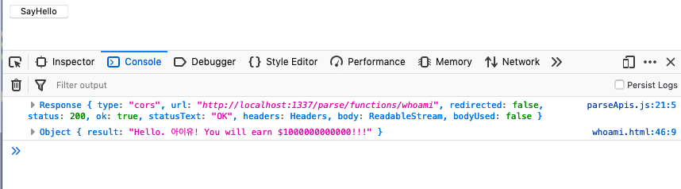
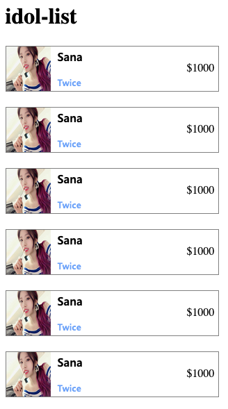
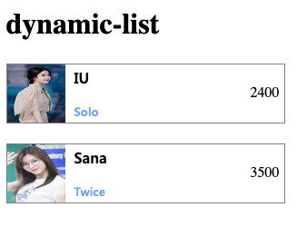

# API 서버 구현 및 프론트엔드와 통신하기2

(example3)

## 프론트엔드에서 서버와 통신하기

이제 프론트엔드에서 지금까지 만든 서버 api를 호출하여 결과물을 보여주도록 하겠습니다.

웹페이지를 만들고 http 요청을 통해 로컬에서 구동되고 있는 NodeJS 서버와 통신을 할 것입니다.

1. 프로젝트 폴더 생성

프론트엔드용 프로젝트 폴더를 만들고

```
/pages
/js
/images
/css
```
로 폴더를 구성해주세요.

2. JavaScript 파일 생성

이제 Postman 등으로 테스트했던 서버와의 통신을 직접 구현해보도록 하겠습니다.

js/parseApis.js

```js
const ParseURL = 'http://localhost:1337/parse/functions/';
const AppID = 'YOUR_PARSE_APP_ID';
const ContentType = 'application/json';

const FETCH_HEADERS = {
  "Content-Type": ContentType,
  "X-Parse-Application-Id": AppID,
}

class ParseApi {
  static async sayHello() {
    const response = await fetch(ParseURL + 'test', {
      method: "POST",
      headers: FETCH_HEADERS,
      body: JSON.stringify({
        "name": "아이유",
        "money": 1000000000000,
      })
    });

    console.log(response);

    return response.json(); // get body stream
  }
}
```

3. html 파일 생성 및 테스트

pages/test.html

```html
<html>
<body>
  <button onclick="hello()">SayHello</button>
</body>
<script src="../js/parseApis.js"></script>
<script>
    async function hello() {
        const result = await ParseApi.sayHello();
        console.log(result);
    }
</script>
</html>
```

test 페이지를 열고 콘솔을 통해 테스트해봅시다.



코드를 모두 이해하고 넘어갈 수 있도록 하세요.

4. getItemList 호출하기

앞에서 했던 getItemList 역시 같은 방식으로 구현해볼 수 있습니다.

pages/test.html

```html
  <button onclick="getItemList()">getItemList</button>
```

js파일과 html 파일의 추가적인 부분은 직접 구현해보세요.

## 기본 웹페이지 구성하기

### 기본 CSS 파일들

fonts.css는 다음 링크에서 받아서 css 폴더에 넣어주세요.
https://drive.google.com/open?id=13DxDKpwvAVTJpC2RxjoyyjOPqFXxmqND


다음 파일들을 css  폴더안에 만들어주세요.

색 등, 변수들을 정의해놓은 css입니다. 컬러코드는 원하는대로 바꿔보세요.

variables.css

```css
:root {
    --greyish-brown: #555555;
    --greyish-brown-two: #525252;
    --soft-blue: #5a87f1;
    --light-periwinkle: hsl(222, 100%, 88%);
    --pale-grey: #e5edff;
    --carolina-blue: #95b0ef;
    --black: #252525;
    --mid-blue: #295aaa;
    --lightish-blue: #4468ff;
    --brown-grey: #7a7a7a;
    --french-blue: #4155a8;
    --very-light-pink: #dcdcdc;

    --wrap-width: 950px;
    --mobile-bottom-padding: 38px;

    --contents-max-width: 1000px;
    --contents-min-width: 360px;
    --tab-button: #6ca2f9;
    --salmon: #ff7070;
    --pale-teal: #83cda4;

}

@media only screen and (max-width: 768px) {
    /* For tablets: */
    .col-s-1 {width: 8.33%;}
    .col-s-2 {width: 16.66%;}
    .col-s-3 {width: 25%;}
    .col-s-4 {width: 33.33%;}
    .col-s-5 {width: 41.66%;}
    .col-s-6 {width: 50%;}
    .col-s-7 {width: 58.33%;}
    .col-s-8 {width: 66.66%;}
    .col-s-9 {width: 75%;}
    .col-s-10 {width: 83.33%;}
    .col-s-11 {width: 91.66%;}
    .col-s-12 {width: 100%;}
  }

@media only screen and (min-width: 768px) {
    /* For desktop: */
    .col-1 {width: 8.33%;}
    .col-2 {width: 16.66%;}
    .col-3 {width: 25%;}
    .col-4 {width: 33.33%;}
    .col-5 {width: 41.66%;}
    .col-6 {width: 50%;}
    .col-7 {width: 58.33%;}
    .col-8 {width: 66.66%;}
    .col-9 {width: 75%;}
    .col-10 {width: 83.33%;}
    .col-11 {width: 91.66%;}
    .col-12 {width: 100%;}
}

.flex-row {
    display: flex;
    flex-direction: row;
}

.flex-column {
    display: flex;
    flex-direction: column;
}

.flex-row-mobile-col {
    display: flex;
    flex-direction: row;
}

@media only screen and (max-width:768px) {
    .flex-row-mobile-col {
        flex-direction: column;
    }
}
```

이건 전체적인 페이지에서 공통적으로 사용될 클래스들입니다.

default.css

```css
@import url(./variables.css);
@import url(./fonts.css);

/********** Basic **********/
body {
    min-width: 344px;
    margin: 0;
}

a {
    text-decoration: none;
}

a:hover {
    color: black;
    cursor: pointer;
  }

  button:hover {
      cursor: pointer;
  }

  button:focus {
      outline: none;
  }

.column-container {
    display: flex;
    flex-direction: column;
}

.row-container {
    display: flex;
    flex-direction: row;
}

/********** Body **********/
.body {
    display: flex;
    flex-direction: column;
    align-items: center;
    width: 100%;
}

.body .contents {
    display: flex;
    flex-direction: column;
    width: 98%;
    max-width: var(--contents-max-width);
}

.body .full-width-contents {
    display: flex;
    align-self: stretch;
    justify-content: center;
}

/********** End Body **********/
```

## Api 호출을 통해 동적으로 리스트 보여주기

이제 본격적으로 그럴듯한 화면을 만들어보도록 하겠습니다.
일단 저장된 아이돌의 리스트를 보여주기 전에 틀을 잡도록 합니다.

### 1. 일단 가상 데이터로 화면 구성하기



코드 작성과 함께 이해를 하고 넘어가도록 합니다. 이미지 파일은 images 폴더에 본인이 원하는 것을 넣고 사용하시거나 웹상의 이미지를 사용해주세요.

templates/idol-list.html

```html
<head>
  <meta charset="utf-8">
  <meta http-equiv="X-UA-Compatible" content="IE=edge">
  <title>idol</title>
  <meta name="viewport" content="width=device-width, initial-scale=1.0">
  <link rel="stylesheet" type="text/css" media="screen" href="../css/default.css">
  <link rel="stylesheet" type="text/css" media="screen" href="./idol-list.css">
</head>

<body>
  <div class="body">
    <div class="contents">
      <h1>idol-list</h1>
      <div class="img-title-tag-list">

        <div class="item row-container">
          
          <div class="column-container">
            <div class="title idol-Name">Sana</div>
            <div class="tags Hashtag">
              <span class="tag">Twice</span>
            </div>
          </div>
          <div class="subinfo-container">
            <span class="Header-Selected">$1000</span>
          </div>
        </div>

        <div class="item row-container">
          
          <div class="column-container">
            <div class="title idol-Name">Sana</div>
            <div class="tags Hashtag">
              <span class="tag">Twice</span>
            </div>
          </div>
          <div class="subinfo-container">
            <span class="Header-Selected">$1000</span>
          </div>
        </div>
    </div>

  </div>
</body>

<script>
</script>
```

templates/idol-list.css

```css
.img-title-tag-list .item {
  width: 505px;
  max-height: 264px;
  overflow: hidden;
  align-items: stretch;
  margin-bottom: 22px;
  border: 1px solid grey;
}

.img-title-tag-list .item .profile {
  height: 100px;
  width: 100px;
}

.img-title-tag-list .item .column-container {
  justify-content: space-between;
  flex: 1;
  margin: 3px;
  margin-left: 10px;
}

.img-title-tag-list .item .subinfo-container {
  display: flex;
  align-items: flex-end;
  justify-content: space-around;
  margin-right: 15px;
}
```

틀이 갖춰졌나요? 이제 해야할 것은 JavaScript를 이용하여 서버와 통신, 응답값을 사용해 새로운 리스트를 생성해내는 것입니다.

### 2. 동적으로 리스트 생성하기

이제 JavaScript로 Api 요청 후 서버 응답값을 이용해 동적으로 리스트 생성을 해보겠습니다.



기존 templates/idol-list.html  파일에 다음을 추가합니다.

```html
...
<h1>dynamic-list</h1>
<div class="img-title-tag-list" id="dynamic-list"></div>
...

<script src='../js/parseApis.js'></script>
<script src='./idol-list.js'></script>
```

templates/idol-list.js

```js
async function getIdolList() {
    const container = document.getElementById('dynamic-list');
    const response = await ParseApi.getItemList();
    console.log(response);

    let htmls = [];
    response.result.forEach(element => {
        const { name, price, group, description, count, imgUrl } = element;

       const html =  `<div class="item row-container">` +
        `` +
        `<div class="column-container">` +
            `<div class="title idol-Name">${name}</div>` +
            `<div class="description">${description}</div>` +
            `<div class="tags Hashtag">` +
                `<span class="tag">${group}</span>` +
            `</div>` +
        `</div>` +
        `<div class="column-container subinfo-container">` +
            `<span class="Sub-Text">Quantity: ${count}</span>` +
            `<span class="Sub-Text">$${price}</span>` +
        `</div>` +
    `</div>`;

    const e = document.createElement('div');
    e.innerHTML = html;

    container.appendChild(e);
    });
}
```

이제 다시 기존 templates/idol-list.html  파일에 다음을 추가합니다.

```html
...

<script src='../js/parseApis.js'></script>
<script src='./idol-list.js'></script>
<script>
  getIdolList();
</script>
```

서버로부터 가져온 데이터를 통해 element를 생성하는게 확인되시나요?
코드를 이해하고 넘어갈 수 있도록 해주세요.

## Conclusion

- 데이터베이스 클래스 생성 및 데이터 추가
- Parse Server에 api 추가
- 외부에서 백엔드 api를 호출해 데이터 응답 확인

자 여기까지 데이터베이스에 직접 데이터를 넣어 보고 외부에서 API 호출을 통해 데이터값을 받는것을 해 보았습니다. 다음 과정에는 실제로 로그인 로직을 구현하고 화면을 구성하도록 하겠습니다.

## 과제

1. 지금까지 만든 서버를 AWS EB 에 배포하고,
2. Parse Dashboard를 이용해 AWS DB에 새로 Character 테이블(클래스)를 추가한뒤 내용을 채우고
3. 방금 만든 웹페이지를 사용해 AWS EB 서버와 통신하여 데이터베이스의 내용을 출력해보세요.

## 참조

- [Parse 공식 가이드 문서](https://docs.parseplatform.org/js/guide/)