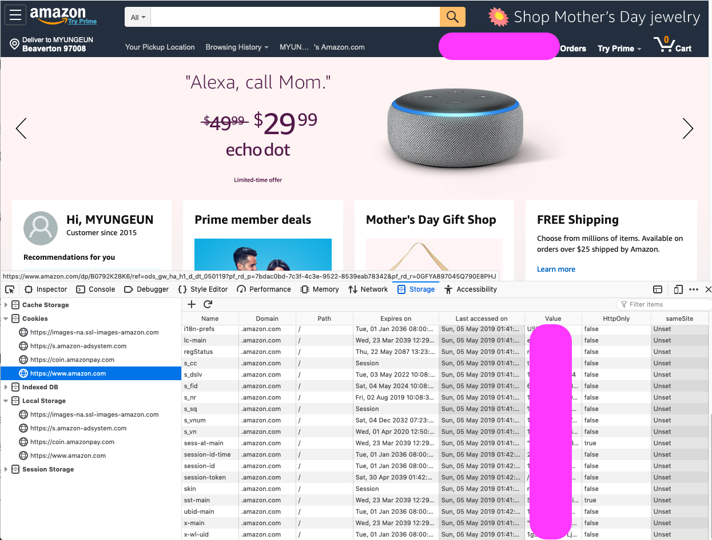
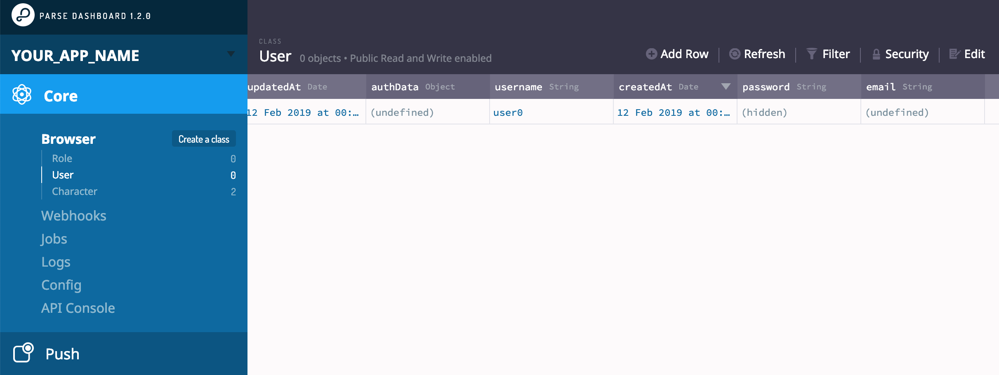
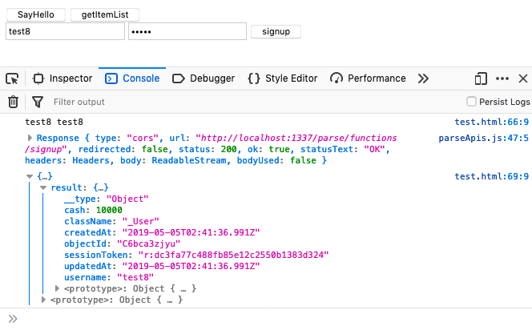
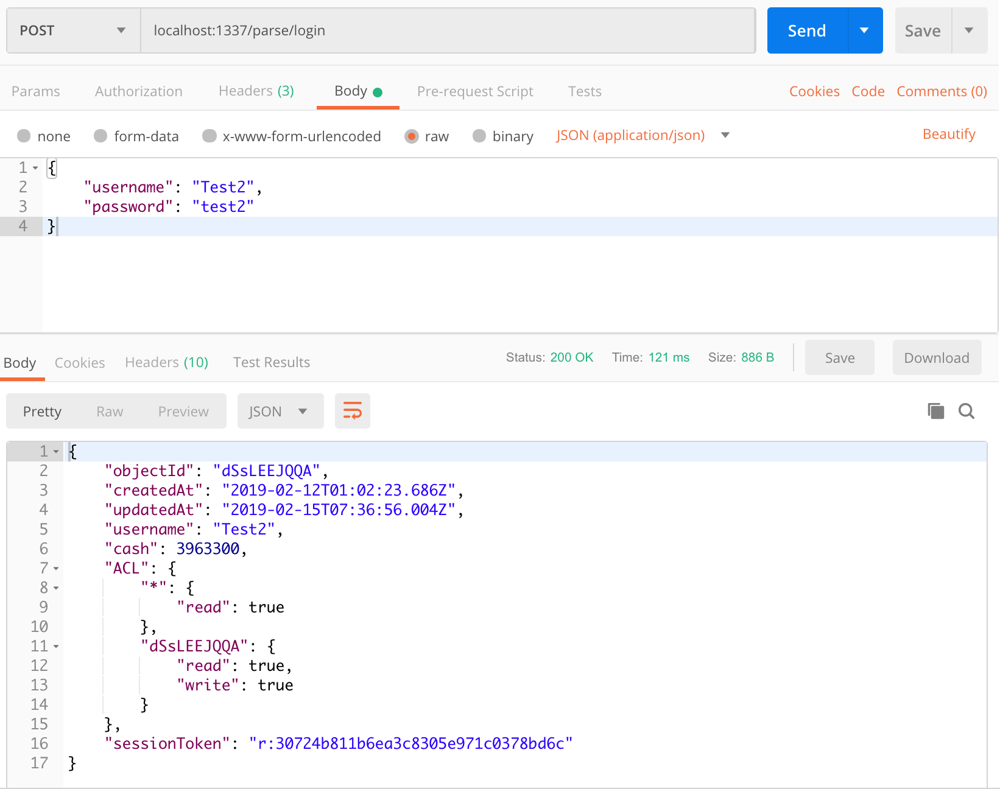
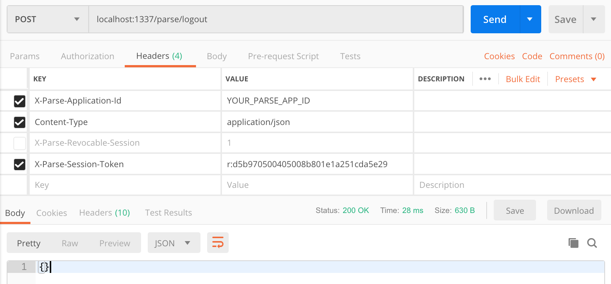
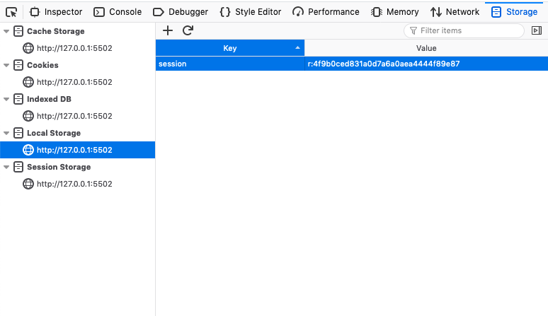
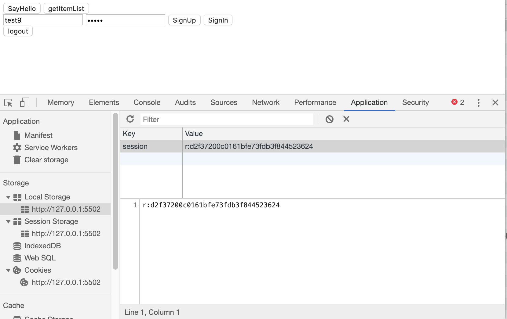

# 유저 관리 동작 구현하기 (로그인, 로그아웃, 회원가입)

## 쿠키, 세션, 로컬 스토리지, 세션 스토리지, 캐시 스토리지

### 쿠키 (Cookie)

클라이언트 로컬에 저장되는 key, value로 이뤄진 파일입니다. 만료 날짜와 경로 정보가 추가적으로 들어가 있습니다.

일정 시간동안 데이터를 저장할 수 있으며 클라이언트에서 서버에 요청을 보낼때 쿠키 정보를 같이 담아 보내는 방식으로 사용되므로, 쿠키 데이터가 많아지면 네트워크 사용량이 늘어나게 됩니다.

예를 들면

1. 클라이언트에서 웹(서버)에 접속
2. 클라이언트가 요청한 웹페이지에 대한 응답을 받으면서 쿠키가 클라이언트에 저장 (브라우져 로컬)
3. 클라이언트에서 다시 요청을 할 때 쿠키값을 같이 전송

ID, Password같은 로그인 정보 또한 이 방식을 통해 저장, 전송할 수 있습니다. 만들어진 쿠키는 사용자가 요청하지 않더라도 Header에 넣어져 보내지게 됩니다.

30일동안 이 창을 보지 않음, 자동로그인, 광고 추적 등에서 활용 가능합니다.

### 세션 (Session)

서버측에서 클라이언트로부터 요청이 왔을때 그 클라이언트의 고유값을 생성하여 저장하고 클라이언트단에서도 그 고유값을 가진채로 둘 간의 커넥션을 유지하는 기술입니다. Unique한 난수값을 생성하여 사용하는 경우가 많으며 서버측에서 세션을 관리할 수 있으므로 보안이 뛰어납니다.

대부분 로그인 유지를 위해 사용하고 있습니다.

1. 클라이언트에서 아이디, 비밀번호를 통해 서버 접속
2. 서버에서 확인 후 세션 ID 생성 및 저장 후 클라이언트에 전송해줌
3. 클라이언트에서 세션 ID를 저장, 그 후 서버에 요청을 보낼때마다 세션ID를 포함하여 요청한다.
4. 서버에서 세션ID를 비교, 확인 후 특정 클라이언트(유저)인 것으로 판별 및 처리


### 로컬 스토리지 (Local Storage), 세션 스토리지 (Session Storge)

하드디스크 영역에 따로 key, value값 등을 저장할 수 있으며 만료일이 따로 없습니다.
로컬 스토리지는 영구적으로 데이터가 저장되며, 세션 스토리지는 접속을 종료(브라우져 종료)하면 데이터가 사라집니다.
보안과 관련없는 값들을 저장하기 좋습니다.

사이트 테마, 대쉬보드 커스텀 등에서 사용하는 것을 추천합니다.



## 회원가입, 로그인, 로그아웃

회원가입, 로그인 등의 기능 을 구현하는 것은 생각보다 많은 수고를 필요로 합니다. 쿠키에 ID, Password 등의 정보를 저장하는것은 현재로서는 보안상 추천하지 않는 방법이므로 서버에서 세션을 저장하고 관리하는 방법을 주로 사용합니다.
Parse Server 프레임워크에서는 세션 기반의 유저 관리 기능이 구현되어 있으므로 큰 수고 없이 편리하게 사용할 수 있습니다.

### 1. Parse.User

`Parse`에는 `User`라는 사용자 관련 오브젝트가 미리 정의되어 있습니다. 회원 가입, 로그인, 유저 정보 업데이트 관련 함수를 통해 유저를 관리할 수 있으며 자세한 사항은 공식 문서를 통해 확인 가능합니다. 기본적으로 Session을 사용하며 세션의 default 유효기간은 1년입니다.

[Parse User](https://docs.parseplatform.org/js/guide/#users)

### 2. 회원가입 api 만들기

회원가입은 유저네임과 패스워드를 User 객체에 set 후 `signUp` 함수를 통해 가능합니다. 아래 예제를 참고하세요.

https://docs.parseplatform.org/js/guide/#signing-up

```js
var user = new Parse.User();
user.set("username", "my name");
user.set("password", "my pass");
user.set("email", "email@example.com");

// other fields can be set just like with Parse.Object
user.set("phone", "415-392-0202");
try {
  await user.signUp();
  // Hooray! Let them use the app now.
} catch (error) {
  // Show the error message somewhere and let the user try again.
  alert("Error: " + error.code + " " + error.message);
}
```

이제 이 예제와 유사하게 저희  Parse Server에서 회원가입 API를 구현해보도록 하겠습니다.

Parse Server 프로젝트에서 코드를 추가하세요.

cloud/functions/index.js

```js
Parse.Cloud.define('signUp', async (req) => {
  const user = new Parse.User();
  const username = req.params.username;
  const password = req.params.password;

  user.set("username", username);
  user.set("password", password);

  if (username == null || password == null) {
    throw Error('There is wrong inputs');
  }

  try {
    const result = await user.signUp();
    return result;
  } catch (error) {
    console.log("Error: " + error.code + " " + error.message);
    throw error;
  }
});
```

signUp을 통해 회원 가입을 시도하고 결과를 리턴하는  함수입니다.
인자로 username, password를 받는것을 볼 수 있습니다.
password나 username을 적지 않은 경우 에러를 리턴하는 로직을 추가하여 잘못된 호출을 방지하였습니다.

앞에서 했던것처럼 postman을 통해 테스트 해봅시다.


대쉬보드에서도 가입된 것을 확인할 수 있습니다.


Password는 암호화되어 관리자라도 복호화된 내용을 확인할 수 없습니다.

이제 이 함수를 호출하는 코드를 클라이언트에 회원가입 화면에 적용하도록 하겠습니다.

### 3. 클라이언트 회원가입

일단 ParseApi 클래스에 회원가입 함수를 추가합니다.

js/parseApis.js

```js
static async signUp(username, password) {
  const response = await fetch(ParseURL + 'signup', {
    method: "POST",
    headers: FETCH_HEADERS,
    body: JSON.stringify({
      username,
      password,
    })
  });

  console.log(response);

  return response.json();
}
```

그 후 input 태그를 사용하여 사용자의 입력을 받고, 회원가입 Api를 호출하는 방식을 사용하겠습니다.

pages/test.html

```html
...
  <div class="signup">
      <input id="input-username" type="text" placeholder="username">
      <input id="input-password" type="password" placeholder="password">
      <button onclick="signUp()">SignUp</button>
  </div>
...
```

js 영역은 다음을 추가합니다.

```html
<script src="../js/parseApis.js"></script>
<script>
    async function hello() {
        const result = await ParseApi.sayHello();
        console.log(result);
    }

    async function getItemList() {
        const result = await ParseApi.getItemList();
        console.log(result);
    }

    async function signUp() {
        const username = document.getElementById('input-username').value;
        const password = document.getElementById('input-password').value;
        console.log(username, password);

        const result = await ParseApi.signUp(username, password);
        console.log(result);
    }
</script>
```

이제 테스트를 해보고 결과를 확인해보세요.



마찬가지로 로그인, 로그아웃을 구현해보도록 하겠습니다.

### 3. LogIn (Rest API)

파스 서버에서는 지금까지 사용한 클라우드 함수 말고도 기본적으로 Rest API 역시 지원을 합니다.
로그인같은 경우 따로 구현할 필요 없이 `example.com/parse/login` 식으로 바로 로그인 요청을 보낼 수 있습니다.



이렇게 따로 구현하지 않아도 바로 로그인이 가능합니다.

이제 클라이언트에서 로그인을 구현해보겠습니다. 회원가입과 비슷하지만 요청 url 이 다른것에 주의하세요.

js/parseApis.js

```js
const ParseURL = 'http://localhost:1337/parse/functions/';
const RestURL = 'http://localhost:1337/parse/'; // Add this line
const AppID = 'YOUR_PARSE_APP_ID';
const ContentType = 'application/json';

....

class ParseApi {
...

  static async signIn(username, password) {
    const response = await fetch(RestURL + 'login', { // User RestURL
      method: "POST",
      headers: FETCH_HEADERS,
      body: JSON.stringify({
        username,
        password,
      })
    });

    console.log(response);

    return response.json();
  }

...
}
```

pages/test.html

```html
...
<div class="signup">
  <input id="input-username" type="text" placeholder="username">
  <input id="input-password" type="password" placeholder="password">
  <button onclick="signUp()">SignUp</button>
  <button onclick="signIn()">SignIn</button>
</div>
...
```

```html
<script>
  async function signIn() {
    const username = document.getElementById('input-username').value;
    const password = document.getElementById('input-password').value;
    console.log(username, password);

    const result = await ParseApi.signIn(username, password);
    console.log(result);
  }
</script>
```

회원가입했던 username과 비밀번호를 이용해 로그인 해보고 응답을 확인해보세요.

Parse Dashboard를 이용해 세션도 확인할 수 있습니다. 또한 로그인을 할 때마다 세션이 늘어나는 것이 확인 가능합니다.

### 4. Logout (Rest API)

로그아웃은 세션정보를 전달하여 해당 세션 정보를 서버에서 지우며 로그아웃을 합니다. 일단 PostMan을 통해 테스트를 해보겠습니다.



X-Parse-Session-Token 에 기존에 생성된 세션값을 입력하여 요청을 보내면 서버에서 해당 세션이 사라지게 되며 로그아웃이 수행됩니다.

### 5. 유저 가입, 로그인, 로그아웃 프로세스 정리

일반적으로 클라이언트에서 유저 가입, 로그인 정보를 저장하고 유지하기 위해서는 세션을 쿠키나 local storage에 저장하여 요청시 전송하는 방식을 많이 사용합니다. 이 방식을 사용한 프로세스를 가정해 보도록 하겠습니다.

1. 클라이언트에서 회원가입 혹은 로그인 후 응답받은 SessionToken을 로컬 스토리지에 저장
2. 다음에 클라이언트에서 요청시 Header에 SessionToken을 포함하여 전송
3. 서버에서 요청을 받은 후 세션을 확인, 비교하고 특정 유저로 판단.
4. 로그아웃 요청시 서버와 클라이언트에서 세션 정보 삭제

현재까지는 클라이언트에서 세션 토큰을 따로 다루지 않았습니다.

세션 토큰을 저저장하는 방법은 로그인 후

```
localStorage.setItem(keyName, keyValue);
```

를 응용해

```js
async function signIn() {
  const username = document.getElementById('input-username').value;
  const password = document.getElementById('input-password').value;
  console.log(username, password);

  const result = await ParseApi.signIn(username, password);
  console.log(result);

  console.log(result.sessionToken);
  localStorage.setItem('session', result.sessionToken);
}
```

식으로 저장이 가능합니다.  회원가입이나 로그인 부분에 구현하고 개발자 모드를 통해 확인해보세요.
(크롬은 Application 탭에서 확인 가능합니다.)

Firefox의 경우


Chrome의 경우


## Conclusion

- 유저 동작 구현하기
- 쿠키, 세션, 로컬 스토리지, 세션 스토리지
- 회원가입, 로그인, 로그아웃 구현


## 참조

- [Parse 공식 가이드 문서](https://docs.parseplatform.org/js/guide/)