# 상품 구매 프로세스 적용하기

## Parse SDK 적용하기

Parse에는 로그인, 로그아웃, 회원가입 뿐 아니라 기본적인 데이터베이스의 CRUD, 권한 등을 다룰수 있는 SDK를 언어마다 제공해주고 있습니다. JavaScript SDK 또한 제공하고 있으므로 이것을 활용하여 빠르고 편리하게 진행을 해보겠습니다.

참고로 저희가 만든 기존 NodeJS 서버에서는 이미 Parse SDK를 사용하고 있습니다.

### 다운로드
순수 JavaScript용 파일은 https://docs.parseplatform.org/js/guide/#getting-started 의 npmcdn 에서 다운로드 가능합니다.

`parse.min.js`를 다운받아 `parseApis.js`가 있는 js폴더에 넣어주도록 하겠습니다. 그 후 사용할 페이지에서 로드를 해주세요.

pages/test.html

```html
...
</body>
<script src="../js/parse.min.js"></script>
<script src="../js/parseApis.js"></script>
```

### SignIn 함수 대체하기

Parse SDK 를 사용하여 유저를 관리하게 되면 세션관리를 자동으로 하게 됩니다. 그러므로 간편하게 서버와의 통신을 할 수 있습니다.

parse.min.js 에는 Parse 라는 클래스가 정의되어 있습니다. Initialize를 시켜줍니다.

js/parseApis.js

```js
Parse.initialize('YOUR_PARSE_APP_ID');
Parse.serverURL = 'http://localhost:1337/parse/';
```

그 후 기존 signin 함수를 Parse SDK 를 이용해 구현해보겠습니다.

```js
  static async signIn(username, password) {
    const user = await Parse.User.logIn(username, password);
    return user.toJSON();
  }
```

단 2줄로 대체가 가능하며 자체적으로 session 관리도 해주기 때문에 브라우져에서 Local Storage를 확인 시 유저 정보가 생긴 것을 알 수 있습니다.

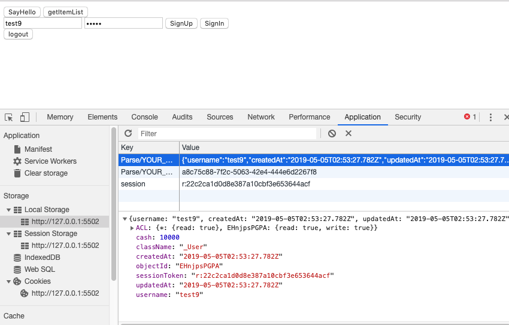

또한,
Parse SDK를 사용하면 `Parse.Cloud.run`을 통해 fetch를 사용하지 않고 간단하게 특정 클라우드 함수를 실행할 수 있습니다.
가령 기존 `signup` 의 경우 fetch 대신 `Parse.Cloud.run('signup', {username, password})` 를 사용 가능합니다.

기존 코드

```js
const response = await fetch(ParseURL + 'signup', {
  method: "POST",
  headers: FETCH_HEADERS,
  body: JSON.stringify({
    username,
    password,
  })
});
```

Parse SDK 사용

```js
const response = await Parse.Cloud.run('signup', {username, password});
```


이와 같이 기존의 만들었던 다른 함수들도 sdk를 사용하여 호출이 가능합니다. 앞으로는 Parse sdk를 적극 활용해보도록 하겠습니다.

## 가입시 기본 유저 데이터 추가하기

### 1. 새로운 유저에게 기본 Cash 추가하기

유저는 서비스에서 상품을 구입하기 위한 캐쉬가 필요합니다. 유저가 새로 가입시 기본적으로 100,000캐쉬를 가지도록 코드를 수정하겠습니다. 회원가입 로직이 있는 백엔드에 코드를 추가합니다.

Parse Server 프로젝트에서
`cloud/functions/index.js`

```js
Parse.Cloud.define('signup', async (req) => {
  const user = new Parse.User();
  const username = req.params.username;
  const password = req.params.password;

  user.set("username", username);
  user.set("password", password);
  user.set("cash", 10000);

  if (username == null || password == null) {
    throw Error('There is wrong inputs');
  }

  try {
    const result = await user.signUp();
    return result;
  } catch (error) {
    console.log("Error: " + error.code + " " + error.message);
    throw error;
  }
})
```

위 코드에서 `user.set("cash", 10000);` 를 통해  가입하는 유저에게 기본 cash를 10000을 줍니다. 잘 동작하는지 클라이언트에서 새로운 계정으로 회원가입을 하고 대쉬보드를 통해 확인해보세요.

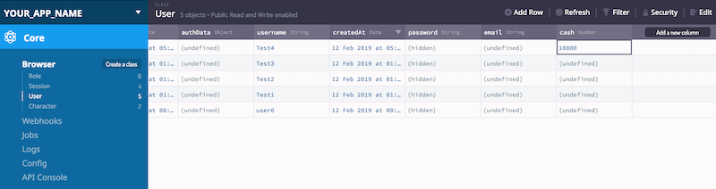

## 상품 구매 구현하기

상품을 구매하면

1. 해당 상품의 금액만큼 유저의 캐쉬가 충분해야 한다.
2. 상품의 개수가 충분해야 한다.
3. 구매한 금액만큼 상품의 개수가 줄고 유저의 캐쉬가 줄어든다.
4. 유저가 보유한 상품의 개수가 는다.

식으로 프로세스가 흘러가게 됩니다. 이제 상품을 구매하고 구매에 따른 변경 사항을 저희 서버를 이용해 데이터베이스에 반영해 보겠습니다.

### 1. 상품 구매 API 만들기

이제 유저가 제품을 구매하고 그 결과가 데이터 베이스에 반영되는 API를 구현해 보겠습니다.

일단 어떠한 식으로 API를 사용할지 먼저 Postman을 통해 테스트 코드를 만들어 보겠습니다.

Parse Server 프로젝트에 새로운 API를 정의하겠습니다.

`cloud/functions/index.js`

```js
Parse.Cloud.define('purchaseItem', async (req) => {
  const user = req.user;
  const objectId = req.params.objectId;
  const count = req.params.count;

  if (user == null) {
    throw Error('There is no user');
  }

  const Character = Parse.Object.extend('Character'); // Get class from database
  let character = new Character();
  character.id = objectId;

  try {
    character = await character.fetch();
    character.increment('count', -count);

    return character.save();
  } catch (error) {
    throw error;
  }
})
```

API를 요청한 `user`와 구매할 상품의 `objectId`, 개수 `count`를 인자로 받는 코드입니다.

```js
  const Character = Parse.Object.extend('Character'); // Get class from database
  let character = new Character();
  character.id = objectId;
  ```

이 코드는 저희가 미리 DB에 만들어놨던 Character 오브젝트를 id를 통해 추려냅니다.

```js
    character = await character.fetch();
    character.increment('count', -count);
```

추려진 제품의 정보를 받아오기 위해 fetch()를 수행하였고,
그 후 구매하고자 하는 제품의 개수만큼 기존 개수에서 `-count`를 해줍니다.

```js
    return character.save();
```

그 후 해당 제품의 변경된 정보를 save하고 그 결과를 리턴하는 코드입니다.

### 2. 상품 구매 API 테스트

이제 바로 코드를 테스트해 보겠습니다. 물론 Parse Server 프로젝트는 재시작 해주셔야 합니다.

Reat Api를 통해 테스트시 현재 유저를 설정하는 법은 해당 유저의 Session을 넣어 같이 전달해주면 됩니다.
> [Session으로 유저 정보 넣기](https://docs.parseplatform.org/rest/guide/#validating-session-tokens--retrieving-current-user)

저희는 Postman 을 사용하기 때문에 아래와 같은 방법으로 적용해주세요.

1. Parse Dashboard 등을 통해 DB에서 테스트할 유저의 세션값을 가져옵니다.

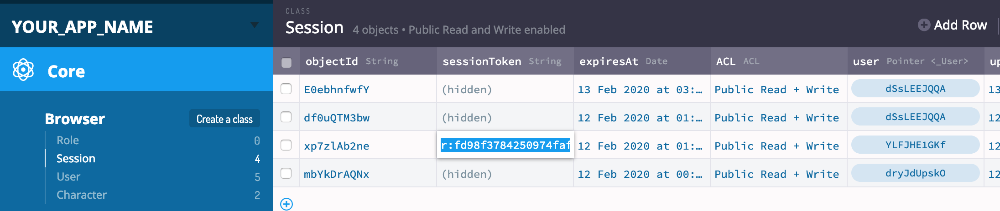

2. 해당 세션 값을 헤더에 `X-Parse-Session-Token` 로 대입해주세요.

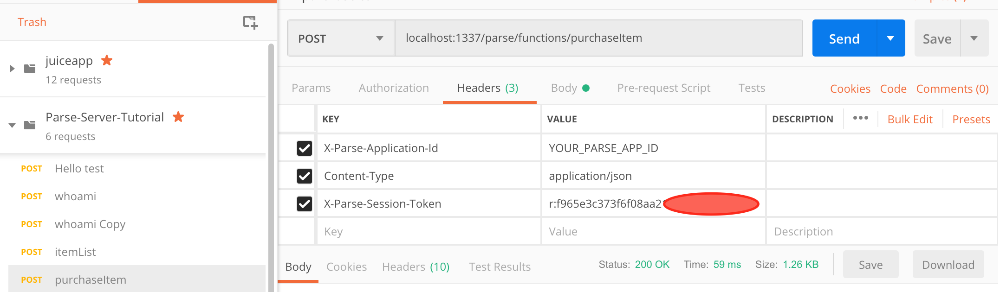

3. 특정 Character의 objectId 값과 구매할 개수를 body 부분에 입력해줍니다. objectId는 등록되어 있는 제품들 중 테스트용으로 사용하실 것으로  고르면 됩니다.

```js
{
  "objectId": "CHARACTER_OBJECT_ID",
  "count": 1
}
```

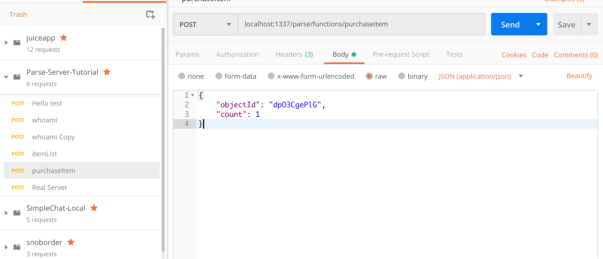

그 후 Send를 통해 API를 호출하면

```js
{
    "result": {
        "createdAt": "2019-01-28T07:55:52.419Z",
        "updatedAt": "2019-02-14T03:44:45.722Z",
        "name": "Pikachu",
        "imgUrl": "https://upload.wikimedia.org/wikipedia/ko/a/a6/Pok%C3%A9mon_Pikachu_art.png",
        "price": 2400,
        "count": 499,
        "description": " 포켓몬스터 애니메이션 시리즈의 마스코트 캐릭터이다. 거의 모든 애니메이션 에피소드에서 빠지지 않고 출현하였다. 지우의 피카츄의 목소리를 연기하는 성우는 오오타니 이쿠에이며, 피카츄의 성우는 모든 나라에서 동일하다. 피카츄의 울음소리만큼은 더빙을 덧입히지 않기 때문이다. ",
        "objectId": "dpO3CgePlG",
        "__type": "Object",
        "className": "Character"
    }
}
```

이런식으로 정상적인 응답이 날아옵니다. 500개 카운트 중에 하나가 줄어 499개가 되었네요. 물론 Parse Dashboard에서도 Count 값의 변화를 확인 가능합니다.

### 3. 상품 구매 API 보강하기

상품 구매를 위해서는 만족해야하는 조건이 몇가지 있습니다.

1. 현재 유저의 캐쉬가 충분한지
2. 상품의 개수가 충분한지

입니다. 이것을 만족시키고 해당 유저의 캐쉬를 사용한만큼 조정하는 코드를 추가하겠습니다.

cloud/functions/index.js

```js
Parse.Cloud.define('purchaseItem', async (req) => {
  const user = req.user;
  const objectId = req.params.objectId;
  const count = req.params.count;

  if (user == null) {
    throw Error('There is no user');
  }

  const userCash = user.get('cash');

  const Character = Parse.Object.extend('Character'); // Get class from database
  let character = new Character();
  character.id = objectId;

  try {
    character = await character.fetch();
    const characterPrice = character.get('price');
    const characterCount = character.get('count');

    if (characterCount < count) {
      throw Error('Not enought amount');
    }

    if (userCash < characterPrice*count) {
      throw Error('There is not enough items');
    }

    character.increment('count', -count);

    return character.save();
  } catch (error) {
    throw error;
  }
})
```

중간에 조건문에서 유저의 캐쉬가 충분한지, 개수가 충분한지를 통해 예외처리를 하는것 을 볼 수 있습니다.

```js
    if (characterCount < count) {
      throw Error('There is not enough items');
    }

    if (userCash < characterPrice*count) {
      throw Error('There is not enough items');
    }
```

이제 Postman에서 구입하고자 하는 제품의 개수를 재고보다 많이 입력하고 테스트해봅시다.

```js
{
  "objectId": "dpO3CgePlG",
  "count": 1000
}
```

그러면 응답으로 미리 설정해 놓은 에러가 뜨는 것을 볼 수 있습니다.

```js
{
  "code": 141,
  "error": "There is not enough items"
}
```

## 유저 상품 구매 내역 데이터

유저가 상품을 구매하면 그 구매 내역을 저장하고 보여줄 수 있어야 합니다.  유저 상품을 관리할 데이터를 따로 구성하고 구매 API에서 연동하도록 하겠습니다.

### 1. 유저 상품 구매 내역용 데이터베이스 생성

일단 유저가 구매한 제품 리스트를 위해`UserCharacter`라는 클래스를 Parse Dashboard를 통해 생성해보도록 하겠습니다.

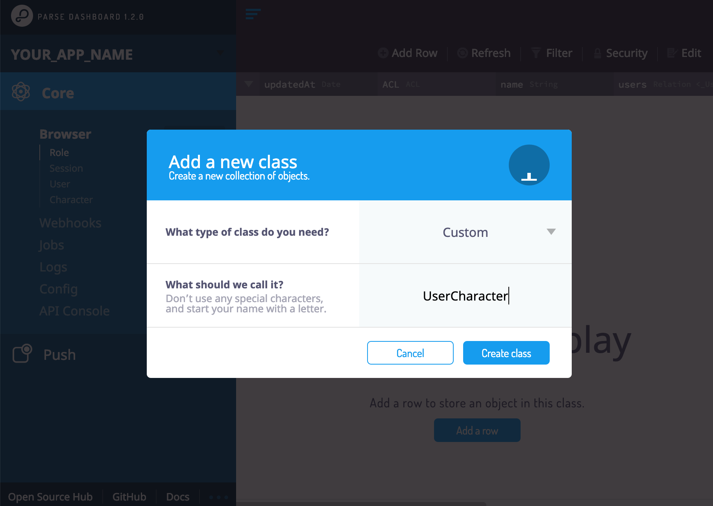

### 2. 코드 수정

이제 완성본 코드를 만들어 보도록 하겠습니다.
Parse Server 프로젝트에서 다시 코드를 수정해주세요.

cloud/functions/index.js

```js
  Parse.Cloud.define('purchaseItem', async (req) => {
  const user = req.user;
  const objectId = req.params.objectId;
  const count = req.params.count;

  if (user == null) {
    throw Error('There is no user');
  }

  const userCash = user.get('cash');

  console.log('UserCash: ', userCash)

  //  Character from objectId
  const Character = Parse.Object.extend('Character'); // Get class from database
  let character = new Character();
  character.id = objectId;

  // userCharacterQuery
  const UserCharacter = Parse.Object.extend('UserCharacter'); // Get class from database
  const userCharacterQuery = new Parse.Query(UserCharacter); // Make query from class

  try {
    character = await character.fetch();
    const characterPrice = character.get('price');
    const characterCount = character.get('count');

    if (characterCount < count) {
      throw Error('There is not enough items');
    }

    if (userCash < characterPrice*count) {
      throw Error('Not enough cash');
    }

    // Find exist characters whice user bought before
    userCharacterQuery.equalTo('user', user);
    userCharacterQuery.equalTo('character', character);
    let userCharacter = await userCharacterQuery.first();

    if (userCharacter == null) {
      userCharacter = new UserCharacter();
    }

    character.increment('count', -count);
    user.increment('cash', -characterPrice);
    userCharacter.set('user', user);
    userCharacter.set('character', character);
    userCharacter.increment('count', count);

    await user.save(null, {useMasterKey: true});
    await userCharacter.save();
    return character.save();
  } catch (error) {
    throw error;
  }
})
```

찬찬히 살펴보도록 하겠습니다.

```js
  //  Character from objectId
  const Character = Parse.Object.extend('Character'); // Get class from database
  let character = new Character();
  character.id = objectId;
```

제품들의 데이터가 담겨있는 Character 오브젝트를 저희가 input 파라미터로 사용한 objectId를 통해 데이터베이스 안에 있는 특정 데이터로 지정해줍니다.

```js
  // userCharacterQuery
  const UserCharacter = Parse.Object.extend('UserCharacter'); // Get class from database
  const userCharacterQuery = new Parse.Query(UserCharacter); // Make query from class
```

유저의 구매 정보를 가지고 있는 UserCharacter 오브젝트에 특정 조건을 수행하기 위한 Query를 생성합니다.

```js
    character = await character.fetch();
    const characterPrice = character.get('price');
    const characterCount = character.get('count');
```

fetch를 통해 character의 최신 데이터를 DB로부터 가져오고, price와 count를 가져옵니다.

```js
     // Find exist characters whice user bought before
    userCharacterQuery.equalTo('user', user);
    userCharacterQuery.equalTo('character', character);
    let userCharacter = await userCharacterQuery.first();

    if (userCharacter == null) {
      userCharacter = new UserCharacter();
    }

```

UserCharacterQuery를 통해 UserCharacter에서 현재 유저가 Character를 보유하고 있는지 확인한 후 없을 시 새로 생성합니다.

```js
    character.increment('count', -count);
    user.increment('cash', -characterPrice);
    userCharacter.set('user', user);
    userCharacter.set('character', character);
    userCharacter.increment('count', count);

    await user.save(null, {useMasterKey: true});
    await userCharacter.save();
    return character.save();
  } catch (error) {
    throw error;
  }
```

여기서 `userCharacter.set('user', user)`와 `userCharacter.set('character', character)`를 통해 userCharacter가 user, character 각각의 오브젝트들을 Relation방식으로 포인터로 연결하였습니다. 자세한 내용은 공식 문서를 참고하세요.

> [Relation](https://docs.parseplatform.org/js/guide/#relations)

### 3. 테스트하기

현재 코드를 테스트하면 에러를 응답합니다.

```js
userCharacterQuery.equalTo('user', user);
userCharacterQuery.equalTo('character', character);
let userCharacter = await userCharacterQuery.first();
```
이 코드 때문입니다.


쿼리에서 user라는 column을 찾아 equalTo를 통해 비교해야하는데 저희가 만든 `UserCharacter` 클래스에는 현재 해당하는 column이 존재하지 않기 때문이죠. 그러므로 Parse Dashboard를 통해 `UserCharacter`안에 `user`, `character`의 pointer column을 각각 만들어 주도록 하겠습니다.

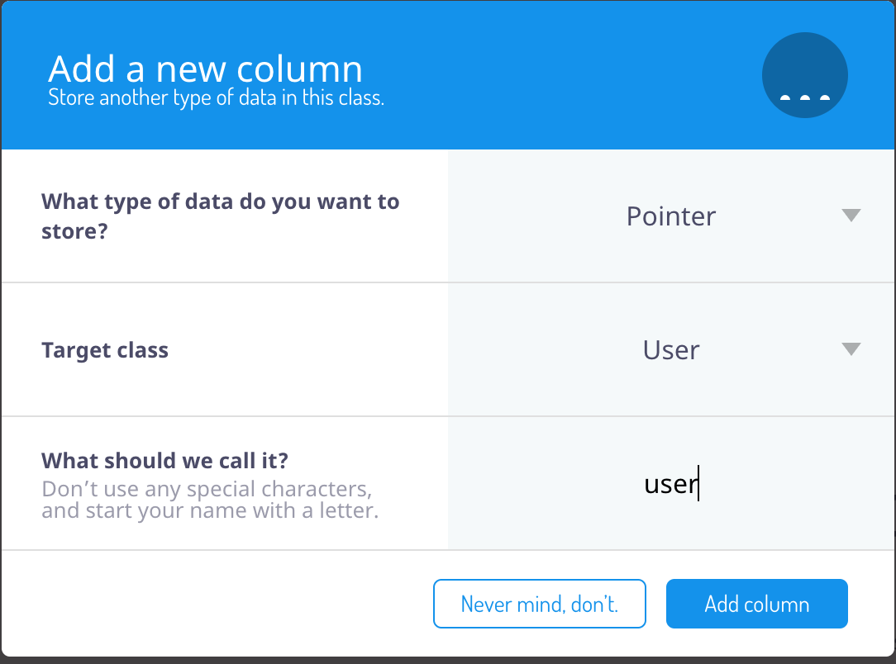

Pointer는 말 그대로 특정 object를 가리키는 데이터베이스에서 흔시 사용하는 타입 중 하나입니다.

> [Using Pointer](https://docs.parseplatform.org/js/guide/#using-pointers)

다시 Postman을 통해 테스트해보고 결과를 확인해봅시다.


UserCharacter에 해당 유저가 소유한 Character 정보가 저장된 것을 볼 수 있습니다. 여러번 테스트하면 Count가 증가합니다.

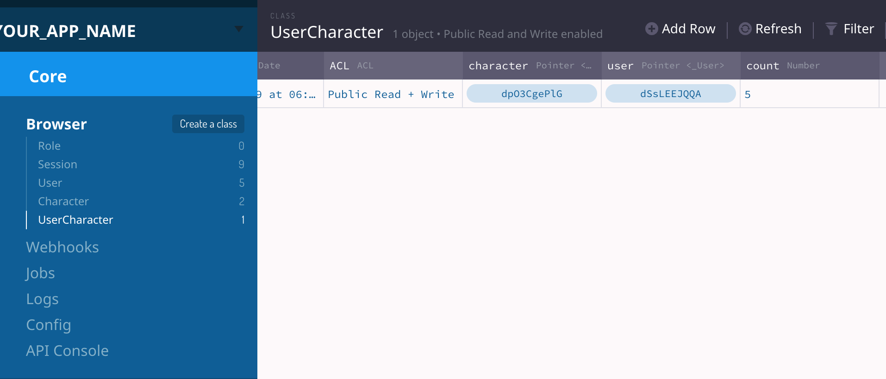


## 클라이언트 연동하기

이제 지금까지 구현한 서버 api를 호출하여 사용하는 클라이언트를 만들어 보겠습니다.

일단 미리 만들어져 있는 `header-footer.html`, `header-footer.css`를 다운받아 `templates` 폴더에 넣어주세요.

header-footer.html: https://drive.google.com/open?id=1jtcVfqXRb6cDRzr86INDVauDQfYzE4AI
header-footer.css: https://drive.google.com/open?id=1lHm44MqscHSAvhBVxmSyOpWQpubzOOE6


### 1. 메인화면 만들기

기존에 작성한 `templates/idol-list.html` 을 활용할 것입니다.
header와 footer는 `header-footer.html` 에서 복사 붙여넣기를 통해 사용해주세요.

이미지는 적당히 넣어주세요.

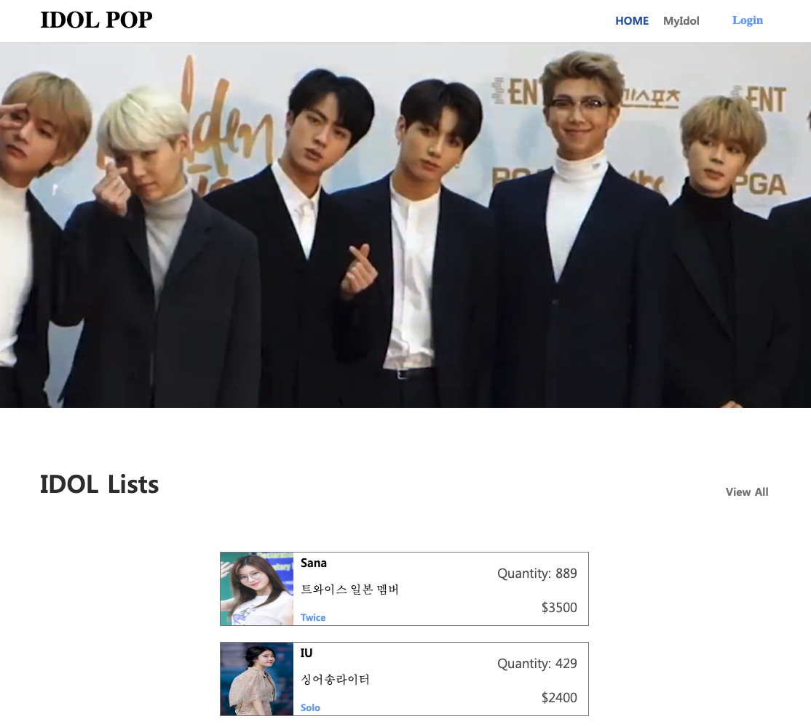

pages/index.html

```html
<!DOCTYPE html>
<html>

<head>
  <meta charset="utf-8">
  <meta http-equiv="X-UA-Compatible" content="IE=edge">
  <title>IDOL </title>
  <meta name="viewport" content="width=device-width, initial-scale=1.0">
  <link rel="stylesheet" type="text/css" media="screen" href="../css/index.css">
</head>

<body>
  <div class="body">
    <div class="header">
      <div class="header-contents">
        <a href="../pages/index.html" class="logo col-s-6">
          <h1>IDOL POP</h1>
        </a>
        <a href="javascript:void(0);" class="icon col-s-6" onclick="hamburgBarToggle()">
          
        </a>
        <nav id="headerNav" class="topnav">
          <button class="close-button" onclick="hamburgBarToggle()">
            
          </button>
          <div class="nav-items">
            <a href="#" class="active Header-Text">HOME</a>
            <a href="#" class="Header-Text">MyIdol</a>
          </div>
          <a  href="../pages/login.html" class="login-container">
            Login
          </a>
        </nav>
      </div>
    </div>

    <div class="full-width-contents">
      
    </div>

    <div class="contents">
      <div class="idol-lists-container">
        <div class="title view-all-container row-container">
          <div class="Big-Title">IDOL Lists</div>
          <a class="Header-Text" href="javascript:void(0);">
            View All
          </a>
        </div>

        <div class="category">

          <div class="container">
            <div class="img-title-tag-list" id="dynamic-list"></div>
          </div>
        </div>

      </div>

    </div>

    <div class="footer">
      <div class="contents">
        <div class="bottom-container">
          <div class="term">
            <div class="link-container Tab-Selected">
              <a>IDOL POP</a>
            </div>
            <a>jeffgukang@gmail.com</a>
            <div class="row-container">
              <a>Term of Service</a>&nbsp | &nbsp<a>Privacy Policy</a>
            </div>
          </div>
        </div>
      </div>
    </div>
  </div>
</body>
<script>
  function hamburgBarToggle() {
    var x = document.getElementById("headerNav");
    if (x.className === "topnav") {
      x.className += " re sponsive";
    } else {
      x.className = "topnav";
    }
  }
</script>
<script src="../js/parse.min.js"></script>
<script src="../js/parseApis.js"></script>
<script src='../templates/idol-list.js'></script>
<script>
  getIdolList();
</script>

</html>
```

### 2. 로그인 화면 만들기

이제 회원가입, 로그인, 로그아웃 을 적용하도록 하겠습니다.

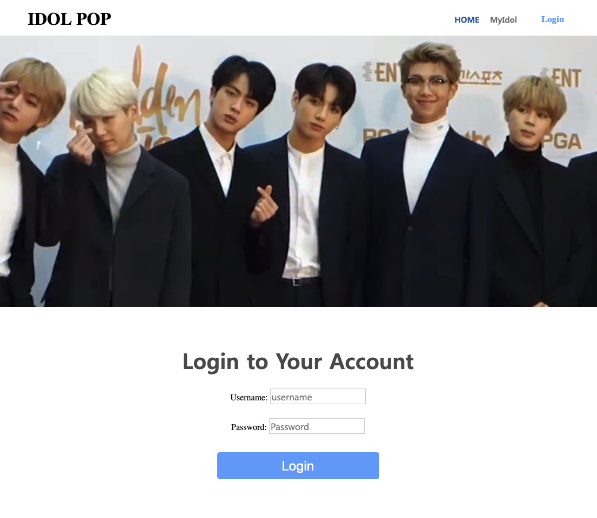

```html
<!DOCTYPE html>
<html>

<head>
  <meta charset="utf-8">
  <meta http-equiv="X-UA-Compatible" content="IE=edge">
  <title>IDOL </title>
  <meta name="viewport" content="width=device-width, initial-scale=1.0">
  <link rel="stylesheet" type="text/css" media="screen" href="../css/index.css">
  <link rel="stylesheet" type="text/css" media="screen" href="../css/login.css">
</head>

<body>
  <div class="body">
    <!-- 기존 header 부분을 추가합니다. -->

    <div class="full-width-contents">
      
    </div>

    <div class="contents" id="login-body">
      <div class="contents-container">
        <div class="login-form-container col-6 col-s-12">
          <div class="Title-Text">Login to Your Account</div>
          <div class="icinputs-container">
            Username: <input type="text" id="input-username" placeholder="username"
              class="Text-Input input-text input-text-email" />
            <div class="input-help-container">
              Password: <input type="password" id="input-password" placeholder="Password"
                class="Text-Input input-text input-text-password" />
            </div>
          </div>

          <button onclick="signIn()" class="submit Button-Text">
            Login
          </button>

          <br />
          <a  href="../pages/signup.html">
            Do you want to sign up?
          </a>

        </div>
      </div>
    </div>

    <!-- 기존 footer 부분을 추가합니다. -->
</body>
<script>
  function hamburgBarToggle() {
    var x = document.getElementById("headerNav");
    if (x.className === "topnav") {
      x.className += " re sponsive";
    } else {
      x.className = "topnav";
    }
  }
</script>
<script src="../js/parse.min.js"></script>
<script src="../js/parseApis.js"></script>
<script>
  async function signIn() {
    const username = document.getElementById('input-username').value;
    const password = document.getElementById('input-password').value;
    console.log(username, password);

    try {
      const result = await ParseApi.signIn(username, password);
      console.log(result);
      if (result.error) {
        alert(result.error);
      }

      location.href = '../pages/index.html';
    } catch(error) {
      alert(error);
    }
  }
</script>

</html>
```

로그인 스크립트를 살짝 수정하여 에러 메세지가 alert창을 통해 출력되도록 하였습니다.

cs/login.css

```css
@import url(./default.css);
@import url(../templates/header-footer.css);

#login-body {
  display: flex;
    flex-direction: column;
    justify-content: center;
  align-items: center;
  font-family: aritadm;
}

.contents-container {
  max-width: var(--contents-max-width);
  width: 100%;
  min-height: 900px;
  display: flex;
    flex-direction: column;
    align-items: center;
}

.login-form-container {
  display: flex;
    flex-direction: column;
    align-items: center;
    text-align: center;
  margin-top: 71px;
}

.login-form-container .ic_header_logo {
  min-width: 130px;
  align-self: flex-start;
}

.login-form-container .title-text {
  font-family: aritadsb;
  margin-top: 35px;
}

.img-background {
  background: pink;
  background: url(../images/photo.png) no-repeat top left;
  background-size: cover;
}

.icinputs-container {
  width: 100%;
  max-width: 400px;
}

.icinputs-container > * {
  margin-top: 26px;
}

.login-form-container button {
  display: flex;
  flex-direction: row;
  align-items: center;
  justify-content: center;
  width: 300px;
  height: 50px;
  border-radius: 5px;
  background-color: var(--tab-button);
    border: none;
    color: white;
    font-size: 25px;
}

.login-form-container button.submit {
  margin-top: 34px;
}
```

로그인 테스트도 해보세요.

### 3. 회원가입 화면 만들기

기존 login.html과 거의 동일합니다.
pages/signup.html

```html
<!DOCTYPE html>
<html>

<head>
  <meta charset="utf-8">
  <meta http-equiv="X-UA-Compatible" content="IE=edge">
  <title>IDOL </title>
  <meta name="viewport" content="width=device-width, initial-scale=1.0">
  <link rel="stylesheet" type="text/css" media="screen" href="../css/index.css">
  <link rel="stylesheet" type="text/css" media="screen" href="../css/login.css">
</head>

<body>
  <div class="body">
    <div class="header">
      <div class="header-contents">
        <a href="../pages/index.html" class="logo col-s-6">
          <h1>IDOL POP</h1>
        </a>
        <a href="javascript:void(0);" class="icon col-s-6" onclick="hamburgBarToggle()">
          
        </a>
        <nav id="headerNav" class="topnav">
          <button class="close-button" onclick="hamburgBarToggle()">
            
          </button>
          <div class="nav-items">
            <a href="#" class="active Header-Text">HOME</a>
            <a href="#" class="Header-Text">MyIdol</a>
          </div>
          <a  href="../pages/login.html" class="login-container">
            Login
          </a>
        </nav>
      </div>
    </div>

    <div class="full-width-contents">
      
    </div>

    <div class="contents" id="login-body">
      <div class="contents-container">
        <div class="login-form-container col-6 col-s-12">
          <div class="Title-Text">SignUp</div>
          <div class="icinputs-container">
            Username: <input type="text" id="input-username" placeholder="username"
              class="Text-Input input-text input-text-email" />
            <div class="input-help-container">
              Password: <input type="password" id="input-password" placeholder="Password"
                class="Text-Input input-text input-text-password" />
            </div>
          </div>

          <button onclick="signUp()" class="submit Button-Text">
            SignUp
          </button>

          <br />
          <a  href="../pages/login.html">
            Already have account.
          </a>

        </div>
      </div>
    </div>

    <div class="footer">
      <div class="contents">
        <div class="bottom-container">
          <div class="term">
            <div class="link-container Tab-Selected">
              <a>IDOL POP</a>
            </div>
            <a>jeffgukang@gmail.com</a>
            <div class="row-container">
              <a>Term of Service</a>&nbsp | &nbsp<a>Privacy Policy</a>
            </div>
          </div>
        </div>
      </div>
    </div>
  </div>
</body>
<script>
  function hamburgBarToggle() {
    var x = document.getElementById("headerNav");
    if (x.className === "topnav") {
      x.className += " re sponsive";
    } else {
      x.className = "topnav";
    }
  }
</script>
<script src="../js/parse.min.js"></script>
<script src="../js/parseApis.js"></script>
<script>
  async function signUp() {
    const username = document.getElementById('input-username').value;
    const password = document.getElementById('input-password').value;
    console.log(username, password);

    try {
      const response = await ParseApi.signUp(username, password);
      if (response.error) {
        alert(response.error);
      } else {
        console.log(response);
        alert(`Welcome, ${response.result.username} \n SignUp Finished`);
        location.href = '../pages/login.html';
      }
    } catch(error) {
      alert(error);
    }
  }
</script>

</html>
```

signUp 부분으로 변경된 함수들을 유의하세요. 회원가입 성공시 웰컴메시지와 함께 로그인 화면으로 이동시키는 코드입니다.

### 4. 로그아웃 만들기

로그아웃은 기존 login 화면에 추가하도록 하겠습니다.

pages/login.html

```html
<button onclick="signIn()" class="submit Button-Text">
  Login
</button>

<br />
<a  href="../pages/signup.html" class="login-container">
  Do you want to sign up?
</a>

<br />
or
<button onclick="logout()" class="submit Button-Text">
  Logout
</button>
```

`signin()` 하단에 logout 관련 함수 역시 추가해줍니다.

```html
<script>
  ...
async function logout() {
  try {
    Parse.User.logOut();
    location.href = '../pages/index.html';
  } catch(error) {
    alert(error);
  }
}
</script>
```

로그인, 로그아웃을 누르며 로컬 스토리지가 어떻게 변하는지 테스트해보세요.

### 4. 로그인한 유저 정보가 저장되어 있는 경우의 처리

Parse SDK를 쓰면 별도의 세션관리를 하지 않아도 유저가 로그인했을때 그 정보를 Local Storage를 이용하여 저장하고 다른 요청에 사용합니다.

메인 화면에서 유저가 로그인 되어 있는지 확인 한 후 헤더를 변경하는 동작을 구현하도록 하겠습니다.

js/parseApis.js

```js
static checkCurrentUser() {
    const user = Parse.User.current();

    if (user) {
      return user.toJSON();
    } else {
      return false;
    }
  }
```

유저가 존재할경우 유저 정보를 리턴하는 함수입니다.
이제  기존 메인화면에 유저 정보를 체크한 후 유저네임을 헤더에 표시하도록 해보겠습니다.

pages/index.html후

```html
<script>
  getIdolList();

  const user = ParseApi.checkCurrentUser();
  if (user) {
    console.log(user);
    const ele = document.querySelector('.header .login-container')
    ele.innerHTML = user.username;
  }
</script>
```

유저 정보를 확인 후 헤더에 이름을 표시해주는 동작을 수행합니다.

### 5. 아이돌 주식 유저 구매 연동하기

이제 유저가 아이돌의 주식을 구매하면 해당 주식을 유저와 연결하고 리스트로 출력해 보도록 하겠습니다.

앞에서 `purchaseItem` 등 서버에서 필요한 동작은 미리 구현이 되어 있으므로 클라이언트만 구현하면 됩니다.


```js
static async purchaseItem({objectId, count}) {
  try {
    const result = await Parse.Cloud.run('purchaseItem', {objectId, count});
    if (result) {
      return  result.toJSON();
    } else {
      return {};
    }
  } catch (error) {
    throw error;
  }
}
```

기존 idol-list.js에서 생성하는 엘레먼트에 `<button class="buy-button">Buy</button>` 을 추가해줍니다.

templates/idol-list.js

```js
const { name, price, group, description, count, imgUrl,  objectId} = element; // Add objectId

      const html =  `<div class="item row-container" id="${objectId}">` + // Edit this line
        `` +
        `<div class="column-container">` +
            `<div class="title idol-Name">${name}</div>` +
            `<div class="description">${description}</div>` +
            `<div class="tags Hashtag">` +
                `<span class="tag">${group}</span>` +
            `</div>` +
        `</div>` +
        `<div class="column-container subinfo-container">` +
            `<span class="Sub-Text quantity">Quantity: ${count}</span>` + // Add class called quantity
            `<span class="Sub-Text">$${price}</span>` +
        `</div>` +
        `<button class="buy-button" onclick="purchaseItem('${objectId}')">Buy</button>` + // Add this line
    `</div>`;
```

코드를 이해하고 넘어가세요.

templates/idol-list.css 에 css 역시 추가해줍니다.

```css
...
.img-title-tag-list .item .buy-button {
    border: none;
    background: var(--lightish-blue);
    color: white;
    font-size: 20px;
}
```

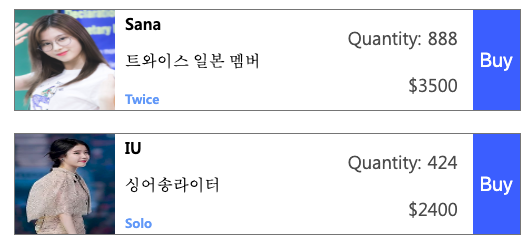

이제 메인 페이지에서 Buy 버튼을 누를시 서버와의 통신을 하고 정상적으로 응답을 받으면 남은 수량을 수정하는 코드를 짜보도록 하겠습니다.

pages/index.html

```html
<script>
  async function purchaseItem(id) {
    const ele = document.getElementById(id);

    const item = {
      objectId: id,
      count: 1
    }
    try {
      const result = await ParseApi.purchaseItem(item);
      console.log(result);

      ele.querySelector('.quantity').innerHTML = 'Quantity: ' + result.count;
    } catch (error) {
      alert(error);
    }
  }
</script>
```

위 코드는 정상적으로 구매가 될 경우 수량을 갱신하고, 오류 발생시 alert창을 띄우는 코드입니다. 로그아웃 후에 구매시도를 하면 세션 정보(유저 정보)가 지워진 상태이므로 에러 메세지가 뜨는것이 정상입니다.

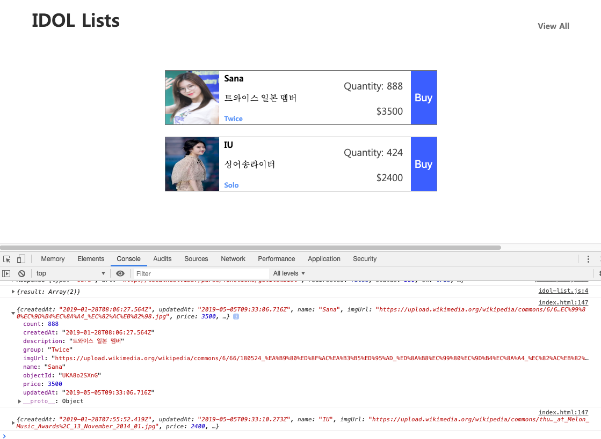


## 과제

여러 브라우져를 띄워 다른 아이디로 로그인 한 후 동작을 확인해보세요. 서로 다른 유저들이 제품 구매를 할 수 있나요?

지금까지 배운것을 응용하면 여러가지 기능을 구현할 수 있습니다. 그 중 서버에 이미 구현이 되어 있는 API를 활용해 추가적인 작업을 진행해보세요.

### 1. 여러 수량 한꺼번에 구매하기

현재는 한번에 하나의 수량만 구매할 수 있도록 구현이 되어 있습니다. 이것을 갯수를 선택해서 구매할 수 있도록 편집해보세요.
힌트는 idol-list.js, index.html 파일 그리고 `purchaseItem`입니다.

### 2. 유저가 구매한 내역을 화면에 보여주기

유저의 구매 내역을 출력하는 코드는 이미 구현이 되어 있고 Postman을 통해 응답값을 확인할 수 있었습니다.
메인 페이지에 유저의 구매 내역을 출력하는 코드를 작성하고, 로그인되어 있을시 유저의 구매내역을 출력, 구매 후 갱신해보세요.

#### 힌트

parseApis.js에서 사용할 함수
`Parse.Cloud.run('getUserItemList');`

응답값 예시

```json
{
    "result": [
        {
            "createdAt": "2019-02-15T07:28:35.825Z",
            "updatedAt": "2019-02-15T07:36:56.113Z",
            "character": {
                "createdAt": "2019-01-28T08:06:27.564Z",
                "updatedAt": "2019-05-05T09:33:06.716Z",
                "name": "Sana",
                "imgUrl": "https://aa.com/abc.jpg",
                "price": 3500,
                "count": 888,
                "description": "트와이스 일본 멤버",
                "group": "Twice",
                "objectId": "UKA8o2SXnG",
                "__type": "Object",
                "className": "Character"
            },
            "user": {
                "__type": "Pointer",
                "className": "_User",
                "objectId": "dSsLEEJQQA"
            },
            "count": 11,
            "objectId": "eu2AnRLqdp",
            "__type": "Object",
            "className": "UserCharacter"
        },
        {
          ...
        }
    ]
}
```


## Conclusion

- Parse Server에 api 추가
- 외부에서 백엔드 api를 호출해 데이터 응답 확인

자 여기까지 데이터베이스에 직접 데이터를 넣어 보고 외부에서 API 호출을 통해 데이터값을 받는것을 해 보았습니다. 다음 과정에는 실제로 로그인 로직을 구현하고 화면을 구성하도록 하겠습니다.

## 참조

- [Parse 공식 가이드 문서](https://docs.parseplatform.org/js/guide/)